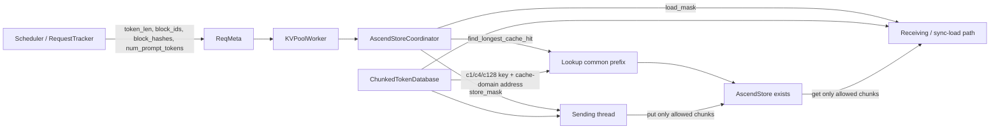

# DeepSeek V4 1M 输入在 AscendStore KV Pool 场景下的低存储、等精度方案

> 基于 [vllm-project/vllm-ascend#10393](https://github.com/vllm-project/vllm-ascend/pull/10393) 的合入实现（merge commit `e6960fa`）。本文中的“池化”指 AscendStore KV Pool 外部 KV 缓存池，不是 embedding/pooling 模型接口。

## 1. 结论

方案的核心不是对已经生成的 KV 做二次有损压缩，而是让 AscendStore 只保存“未来合法 prefix cache hit 真正可能读取”的块，并让 DeepSeek V4 的压缩缓存按照真实压缩域建立 key 和地址映射。

因此，1M 输入下可以同时做到：

1. **c4/c128 保留完整压缩后 KV**：c4 每 512 个原始 token 形成一个外存 chunk，c128 每 16,384 个原始 token 形成一个外存 chunk（假设 block size 为 128）。这两类全局压缩缓存不做稀疏裁剪。
2. **SWA/Mamba 等局部状态只保留可达尾块**：不再把 1M 范围内每个 128-token 物理块都写入外存；默认仅在 16K 对齐命中边界保存一次窗口尾部，还可通过 retention interval 进一步稀疏化。
3. **命中必须在所有必需 cache group 上收敛**：任一必要组缺失即缩短命中长度或返回 miss，触发重算，不允许拿“残缺 KV”继续计算。
4. **保存与加载使用同一组 manager mask**：删除的是未来 prefix hit 不可能消费的外存副本，不是当前推理需要访问的模型状态。

代码层面能够证明“优化路径与本地 KV cache manager 的可达性语义一致”；但 PR 没有提供 1M 端到端模型精度报告。因此上线前仍需通过本文第 9 节的 logits/输出 A/B 门禁，才能把“精度正常”升级为实测结论。

## 2. 背景与问题定义

DeepSeek V4 混合使用 c4a、c128a 和短滑窗注意力。vLLM 官方说明中，c4 约按 1/4 保存，c128 约按 1/128 保存；模型包含 30 个 c4a 层和 31 个 c128a 层，并面向 1M context。模型本身已经把 1M 下的 BF16 KV 从类似 V3.2 的约 83.9 GiB 降到约 9.62 GiB。参见 [vLLM DeepSeek V4 技术说明](https://github.com/vllm-project/vllm-project.github.io/blob/main/_posts/2026-04-24-deepseek-v4.md)。

但模型内存压缩不自动等价于外存池正确、高效：

- 若 KV Pool 仍按 128 个原始 token 给 c128 建 key，会把本应以 16K 原始 token 为一个有效单元的缓存切碎，造成 key 数量、地址域和物理压缩域不一致。
- 对短滑窗/对齐状态而言，未来在 prefix 边界恢复时只会用到窗口尾部；把此前所有历史块写入 AscendStore 没有复用价值。
- 混合 cache group 不能各自独立宣称命中；命中长度必须同时满足 full/compressed/SWA/Mamba 等组的 manager 规则。

## 3. 设计目标与非目标

### 3.1 目标

- 1M prompt 下显著减少 AscendStore 的 `put` key 数、写入字节数和后续 `get` 字节数。
- 外存命中结果与 vLLM 本地 hybrid KV cache manager 的命中语义一致。
- 不改模型权重、attention 数学公式、KV dtype 和 KV 数值。
- 外存缺块、网络异常、长度未对齐时优先退化成 cache miss 或全量保存，而不是错误命中。
- 非 hybrid、单组或 layerwise 等未覆盖路径保持原行为。

### 3.2 非目标

- 本方案不降低 DeepSeek V4 c4/c128 的模型内生 KV 数量。
- 不承诺 retention 越激进吞吐一定越高；少存会减少可复用 checkpoint，可能增加重算。
- 不用单元测试替代 1M 端到端精度与容量验证。

## 4. 总体架构



### 4.1 代码模块映射

| 模块 | 责任 |
|---|---|
| [`coordinator.py`](https://github.com/vllm-project/vllm-ascend/blob/e6960fa41ab50cdec36b17b2f239895f9418e627/vllm_ascend/distributed/kv_transfer/kv_pool/ascend_store/coordinator.py) | 按 cache manager 计算公共命中长度、store mask 和 load mask；处理 c1/c4/c128 有效粒度。 |
| [`config_data.py`](https://github.com/vllm-project/vllm-ascend/blob/e6960fa41ab50cdec36b17b2f239895f9418e627/vllm_ascend/distributed/kv_transfer/kv_pool/ascend_store/config_data.py) | 推导 cache family；生成带 group/role/family 的 key；把原始 token 区间映射到压缩 cache-domain 地址；传递 `num_prompt_tokens`。 |
| [`pool_worker.py`](https://github.com/vllm-project/vllm-ascend/blob/e6960fa41ab50cdec36b17b2f239895f9418e627/vllm_ascend/distributed/kv_transfer/kv_pool/ascend_store/pool_worker.py) | 计算 transfer granularity，构建 coordinator，批量查询各组 key，并把存在性集合交给 coordinator 收敛。 |
| [`kv_transfer.py`](https://github.com/vllm-project/vllm-ascend/blob/e6960fa41ab50cdec36b17b2f239895f9418e627/vllm_ascend/distributed/kv_transfer/kv_pool/ascend_store/kv_transfer.py) | 在真正的 `put/get` 前应用 per-group mask；显式携带与 chunk 对应的 block id。 |
| [`pool_scheduler.py`](https://github.com/vllm-project/vllm-ascend/blob/e6960fa41ab50cdec36b17b2f239895f9418e627/vllm_ascend/distributed/kv_transfer/kv_pool/ascend_store/pool_scheduler.py) | 把完整 prompt 长度和 cache family 等元数据送到 worker 路径。 |

## 5. 为什么 1M 输入可以存得更少

### 5.1 第一层：保住 DSV4 的 c4/c128 内生压缩比例

定义：

- 原始输入长度：`T`
- cache-domain block size：`b`
- cache family 压缩比：`r`，c1/c4/c128 分别为 1/4/128
- 外存有效原始 token 粒度：`g = b × r`

`ChunkedTokenDatabase.process_tokens()` 先把连续 `r` 组 hash block 重新哈希成一个 chunk key，然后把原始 token 坐标除以 `r`，再映射到物理压缩 cache 地址：

```text
key domain:       [j × b × r, (j + 1) × b × r) 个原始 token
address domain:   [j × b,     (j + 1) × b)     个压缩 cache 位置
```

在 `T = 1,048,576`、`b = 128` 时：

| cache family | 有效粒度 | 1M 下外存 chunk/key 数 | 相对按 c1 错切的 key 数 |
|---|---:|---:|---:|
| c1 | 128 | 8,192 | 1× |
| c4 | 512 | 2,048 | 1/4 |
| c128 | 16,384 | 64 | 1/128 |

这里减少的不只是 key 元数据。每个有效 chunk 只传输一个 cache-domain block，实际数据量随 `T/r` 增长，因而 AscendStore 不会把 c128 的物理缓存误当成 c1 规模存储。

### 5.2 第二层：SWA/Mamba 只保存未来命中可达的尾块

对窗口大小为 `W` 的滑窗组，未来在合法 prefix hit 长度 `L` 恢复时，注意力只可能读取 `[L-W, L)`；更早的块已经离开窗口。历史每个物理块都写入外存，不会提高该命中点的可恢复性。

PR 通过 `SingleTypeKVCacheManager.reachable_block_mask()` 复用本地 prefix cache 的可达性判断：

- full attention：所有 chunk 都保留；
- c4/c128：该 PR 显式保持 unmasked，所有压缩后 chunk 都保留；
- c1 的 SWA/Mamba/align 状态：只保留合法命中边界所需的窗口尾部；
- `VLLM_PREFIX_CACHE_RETENTION_INTERVAL=K` 时，每 K token 段只保留一次尾部，并额外保留当前 prompt 的 replay boundary；
- `K=0` 时只保留最新 replay boundary。

这套 retention 语义直接来自 vLLM MooncakeStore 参考实现；上游说明明确指出它保存“未来本地 prefix-cache hit 可以实际消费的块”，参见 [vllm#44774](https://github.com/vllm-project/vllm/pull/44774)。

### 5.3 1M 数量级示例

假设：

- `T = 1,048,576`
- `b = 128`
- DSV4 同时存在 c128，因此 transfer granularity `A = lcm(128, 512, 16,384) = 16,384`
- SWA 窗口 `W = 128`

旧的全存策略对一个 c1/SWA 组需要 `T/b = 8,192` 个块。

| retention 策略 | 需要保存的 SWA 块（每组） | 相对 8,192 全存 |
|---|---:|---:|
| 默认 `None`：每个 16K 合法边界留一个 128-token 尾块 | 64 | 128× 更少 |
| `K=65,536`：每 64K 留一次，外加最多一个 replay 尾块 | 16～17 | 约 482～512× 更少 |
| `K=0`：只留 replay 尾块 | 1 | 8,192× 更少 |

这是受影响的 c1/SWA 部分的缩减，不应直接等同于整套 KV Pool 的总压缩比；总量还包含必须完整保留的 c4/c128、indexer、compressor state、dtype、TP/PP 副本和 backend 元数据。

作为数量级参考，如果只用官方博客的 BF16 shared-KV 单 entry 1,024 bytes、61 层进行简化估算：把 1M 个 SWA token 全存约为 61 GiB；默认 64 个 checkpoint、每次仅留 128-token 尾部约为 488 MiB。该值仅解释收益来源，不是 Ascend 部署容量承诺，实际应以第 9 节的 backend `put_bytes` 计数为准。

## 6. 为什么不损失精度

### 6.1 不改变数值计算

PR 没有改 attention 公式、模型权重、KV dtype 或 KV tensor 内容；只决定哪些现有 KV 块需要复制到外存，以及命中时复制回来哪些块。因此它不会引入新的量化误差。

### 6.2 c4/c128 全局信息不被稀疏裁剪

`_uses_reachable_mask()` 只对 `default/c1` 使用 manager reachability；c4/c128 的 store/load mask 全为 True。也就是说：

- c4 的全部压缩后全局 KV 保留；
- c128 的全部压缩后全局 KV 保留；
- 仅把 key 粒度从原始 token 域正确映射到压缩 cache 域。

这点非常关键：存得更少是因为“一条 c128 cache entry 已代表 128 个原始 token”，不是因为任意丢弃 127/128 的信息。

### 6.3 删除的 SWA 块在恢复点不可达

对命中边界 `L`，SWA 只读取窗口尾部 `[L-W, L)`。`reachable_block_mask()` 与本地 KV cache manager 使用同一规则，因此 mask=False 的块不会被未来合法命中消费。保留窗口尾部即可恢复与未 offload 相同的下一 token 上下文。

### 6.4 公共命中长度必须跨组收敛

Lookup 先按 group 查询 AscendStore，再把 `(group_id, hash)` 存在性集合交给 coordinator。coordinator 对各类 manager 反复收敛 `hit_length`，直到所有必要组都能支持同一命中长度。

因此：

- c1 命中但 c128 缺失：返回 0 或更短命中；
- full group 命中更长、SWA 只能支持更短：以更短长度为准；
- 不会把“某一组命中”误报为“整个模型状态命中”。

对应单测 `test_missing_required_group_returns_zero` 已覆盖必要组缺失返回 0。

### 6.5 保存/加载/查询共享同一语义

- `store_mask` 决定哪些块写入；
- `lookup` 用相同 group 粒度判断可恢复的最长前缀；
- `load_mask` 决定哪些块读取；
- `mask_allows_chunk()` 在发送线程、异步接收线程和同步 load 路径中执行相同筛选。

这避免“保存时裁掉、查询却认为存在”或“查询命中、加载又少一块”的语义漂移。

### 6.6 元数据与安全回退

- `num_prompt_tokens` 从 scheduler/request tracker 传到 `ReqMeta`，用于计算真实 replay boundary。
- key 包含 model、rank、group、cache role、cache family 和 chunk hash，避免 c1/c4/c128 或 KV/state 互相串用。
- 组合 hash 使用 SHA-256、domain separator 和长度前缀，保证相同原始 token 分组得到稳定 key。
- store 长度要求对齐 transfer granularity；若断言失败，发送线程返回 `None` mask，即退化为全存，优先保证正确性。
- 外存查询异常时返回 0 命中，走重算而不是错误复用。
- 非 hybrid 或未构建 coordinator 的路径保持 legacy 行为。

## 7. 推荐配置策略

### 阶段一：保守上线

- 使用 PR 对应版本组合：vLLM Ascend 合入提交与其验证过的 vLLM 版本必须成对锁定。
- block size 采用已验证的 128；确保 `hash_block_size`、c4 有效粒度 512、c128 有效粒度 16,384 均整除 `cache_transfer_granularity`。
- `VLLM_PREFIX_CACHE_RETENTION_INTERVAL` 先保持默认 `None`。

默认配置已经可把 128-token SWA 的外存块从 8,192 降到 64，同时保留每个 16K 合法命中边界，缓存命中密度最保守。

### 阶段二：容量优先

- 建议从 `K=65,536` 开始，且 K 取 16,384 的整数倍。
- 根据真实流量的 prefix 长度分布，在 64K、128K、256K 中选择。
- 监控节省的 `put_bytes/get_bytes` 与新增 prefill recompute tokens 的交换关系。

### 阶段三：极限低存储

- `K=0` 只保留 replay boundary，适合主要复用“完整大 prompt/续算”的业务。
- 它不应改变输出精度，但会显著减少中间 prefix 的可命中点，可能增加重算和 TTFT。

## 8. 已知边界与建议加固

1. **PR 没有 1M E2E 精度数据**：现有单测证明控制流和 mask 应用，不等价于模型质量证明。
2. **部分重叠 load chunk**：review 中指出 `process_tokens()` 使用 `start_idx < mask_num` 过滤。如果未来 `mask_num` 不再按压缩有效粒度对齐，可能跳过与本地前缀部分重叠但仍需加载的 chunk。当前 DSV4 默认路径因 transfer granularity 含 c128 的 16K 粒度而安全。建议生产版本增加：
   - `assert mask_num % group_effective_granularity == 0`；或
   - 改成仅在 `end_idx <= mask_num` 时跳过。
3. **layerwise hybrid 未覆盖**：worker 明确禁止多 group layerwise；不可绕过该限制。
4. **版本耦合**：coordinator 对不同 vLLM manager API 有兼容分支，升级 vLLM 时必须重跑 mask contract tests。
5. **少存与命中率是权衡**：retention interval 不影响命中后的数值正确性，但会决定有多少中间边界可命中。

## 9. 1M 精度与容量验收方案

### 9.1 对照组

固定同一模型、权重、dtype、并行配置、随机种子和 deterministic 开关：

- A：KV Pool 关闭，完整 prefill 重算；
- B：KV Pool 开启但 store mask 全 True；
- C：本 PR，retention `None`；
- D：本 PR，`K=65,536`；
- E：本 PR，`K=0`。

### 9.2 长度与命中点

- prompt：128K、512K、1,000,000 和 1,048,576 token；
- 命中点：16K 边界、64K 边界、prompt replay boundary、非对齐尾部；
- 覆盖首次请求、第二次完整命中、部分前缀命中、缺失 c4/c128 key、外存异常回退。

### 9.3 精度门禁

1. 对每个命中点比较 A/B/C/D/E 的下一 token logits：
   - FP16/BF16：`max_abs_diff <= 1e-3`、`max_rel_diff <= 1e-3`；
   - FP8 路径按现有无 KV Pool 基线设阈值，不允许 PR 额外扩大误差。
2. greedy decoding 生成至少 256 token，token 序列必须完全一致；若底层 kernel 非确定，至少要求 top-1、top-5 集合和语义 benchmark 不回退。
3. 对已加载 KV block 做地址范围检查与 CRC/byte compare；外存传输本身应逐字节一致。
4. 跑 1M needle/MRCR/长文 QA 基线；C/D/E 相对 A 的分数差必须在预设噪声带内。
5. 任一必要 group 人工删除一个 key，必须观测到 hit length 收缩或 0 命中，并由重算得到与 A 一致的输出。

### 9.4 容量与性能门禁

按 cache family 和 group 暴露：

- `kv_pool_put_keys_total`
- `kv_pool_put_bytes_total`
- `kv_pool_get_keys_total`
- `kv_pool_get_bytes_total`
- `kv_pool_hit_tokens`
- `kv_pool_recompute_tokens`
- `kv_pool_mask_kept_chunks{family,group}`
- `kv_pool_mask_dropped_chunks{family,group}`
- `kv_pool_alignment_fallback_total`

1M、block size 128 的结构性断言：

- c4 key 数应约为 2,048/组；
- c128 key 数应约为 64/组；
- W=128 的 c1/SWA 在默认 retention 下应约为 64 块/组；
- `K=65,536` 时应约为 16～17 块/组；
- missing required group 不得仍返回完整 1M hit。

## 10. 测试证据与发布门禁

PR 已包含：

- c128 在 `128 × 128 = 16,384` 有效边界命中的测试；
- 必要 group 缺失时返回 0 的测试；
- SWA 使用 manager reachability 的测试；
- c4/c128 store/load 保持 unmasked 的测试；
- sender/receiver 实际只传 mask=True key 的测试；
- PR 页面显示合入前 34 checks passed。

参考测试文件：

- [`test_coordinator.py`](https://github.com/vllm-project/vllm-ascend/blob/e6960fa41ab50cdec36b17b2f239895f9418e627/tests/ut/distributed/ascend_store/test_coordinator.py)
- [`test_kv_transfer.py`](https://github.com/vllm-project/vllm-ascend/blob/e6960fa41ab50cdec36b17b2f239895f9418e627/tests/ut/distributed/ascend_store/test_kv_transfer.py)

正式发布还应补齐：

- 真实 DeepSeek V4 1M A/B logits；
- 真实 AscendStore `put/get bytes`；
- TP/PP/PCP/DCP 组合；
- chunked prefill、PD 分离、EAGLE/MTP；
- 故障注入与未对齐长度；
- 至少 24 小时混合长度压测，确认命中率、TTFT、外存容量和重算量的稳定性。

## 11. 最终保证口径

建议对外使用以下表述：

> 该方案通过复用 vLLM 本地 KV cache manager 的 block reachability 规则，跳过未来合法 prefix hit 不会消费的 SWA/Mamba 外存块；同时对 DeepSeek V4 c4/c128 使用 512/16K 原始 token 的有效 key 粒度，并完整保存其压缩后 KV。任何必要 cache group 缺失都会降级为更短命中或重算。因此，优化不改变模型计算和 KV 数值，代码语义上保持缓存等价；在通过 1M logits、生成 token 和长上下文 benchmark A/B 门禁后，可确认精度无回退。
