# Mooncake SSD 存储实现深度解析

> 本文基于 Mooncake 源码，深入解析其 SSD 存储的两种实现方式——**本地 SSD Offload** 与 **NVMe-oF SSD 资源池**，重点阐述 SSD 在 NPU（昇腾 Ascend）上的实现机制，涵盖架构设计、数据流、存储后端、I/O 优化及性能表现。

---

## 一、背景：为什么 Mooncake 需要 SSD？

在大语言模型（LLM）推理场景中，KV Cache 的容量直接决定了系统的缓存命中率和推理效率。随着多轮对话、长上下文等场景的普及，仅依赖 DRAM 已无法满足日益增长的 KV Cache 存储需求。

Mooncake Store 的核心定位是**分布式 KV Cache 存储引擎**，其存储层次如下：

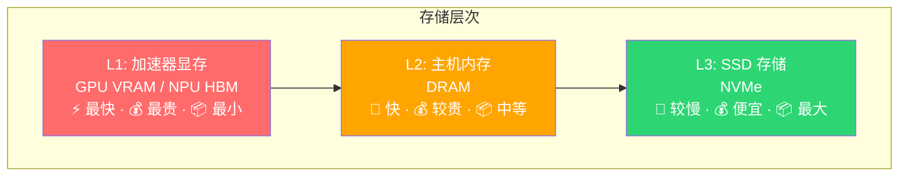
```mermaid
graph TB
    subgraph 存储层次
        L1["L1: 加速器显存<br/>GPU VRAM / NPU HBM<br/>⚡ 最快 · 💰 最贵 · 📦 最小"]
        L2["L2: 主机内存<br/>DRAM<br/>🚀 快 · 💰 较贵 · 📦 中等"]
        L3["L3: SSD 存储<br/>NVMe<br/>🏃 较慢 · 💰 便宜 · 📦 最大"]
    end
    L1 --> L2 --> L3
    style L1 fill:#ff6b6b,color:#fff
    style L2 fill:#ffa502,color:#fff
    style L3 fill:#2ed573,color:#fff
```

当 DRAM 容量不足时，被驱逐的 KV Cache 条目若直接丢弃，将导致缓存命中率骤降、TTFT 飙升。SSD 存储的引入正是为了解决这一"性能悬崖"问题——将被驱逐的数据持久化到 SSD，在需要时再加载回来。

Mooncake 提供了**两种 SSD 实现方式**，分别适用于不同场景：

| 特性 | 本地 SSD Offload | NVMe-oF SSD 资源池 |
|------|-----------------|-------------------|
| 存储位置 | 各节点本地 NVMe SSD | 远程 SSD 集群（通过 RDMA 网络访问） |
| 核心技术 | FileStorage + StorageBackend | SPDK NVMe-oF + SpdkNofWorkerPool |
| 数据流向 | DRAM → 本地 SSD → DRAM | DRAM → 远程 SSD（RDMA）→ DRAM |
| 部署复杂度 | 低（单节点即可） | 高（需部署 SPDK 目标端） |
| 适用场景 | 通用场景、多轮对话 | 大规模集群、SSD 资源池化 |
| I/O 引擎 | POSIX / io_uring | SPDK 用户态驱动 |

---

## 二、方式一：本地 SSD Offload

### 2.1 整体架构

本地 SSD Offload 是 Mooncake 中最成熟的 SSD 实现方式，其核心思想是：**当 Master 检测到内存压力时，指示 Real Client 将被驱逐的 KV Cache 对象持久化到本地 NVMe SSD；当 Get 请求在内存中未命中时，自动回退到 SSD 读取。**

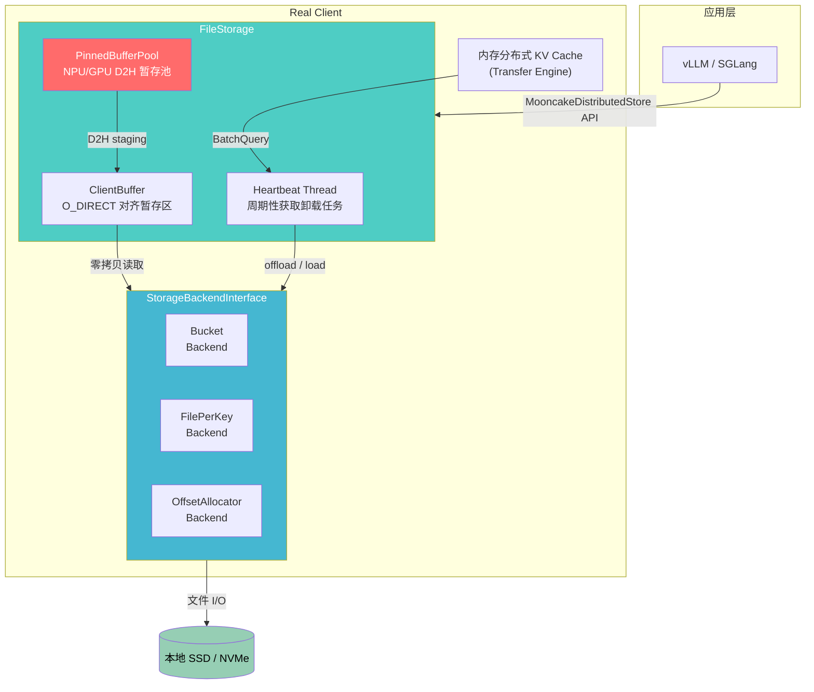
```mermaid
flowchart TB
    subgraph APP["应用层"]
        VLLM["vLLM / SGLang"]
    end

    subgraph RC["Real Client"]
        subgraph FS["FileStorage"]
            HB["Heartbeat Thread<br/>周期性获取卸载任务"]
            CB["ClientBuffer<br/>O_DIRECT 对齐暂存区"]
            PBP["PinnedBufferPool<br/>NPU/GPU D2H 暂存池"]
        end
        subgraph SBI["StorageBackendInterface"]
            BB["Bucket<br/>Backend"]
            FPB["FilePerKey<br/>Backend"]
            OAB["OffsetAllocator<br/>Backend"]
        end
        TE["内存分布式 KV Cache<br/>(Transfer Engine)"]
    end

    SSD[("本地 SSD / NVMe")]

    VLLM -->|"MooncakeDistributedStore API"| FS
    HB -->|"offload / load"| SBI
    PBP -->|"D2H staging"| CB
    CB -->|"零拷贝读取"| SBI
    SBI -->|"文件 I/O"| SSD
    TE -->|"BatchQuery"| HB

    style FS fill:#4ecdc4,color:#fff
    style SBI fill:#45b7d1,color:#fff
    style SSD fill:#96ceb4,color:#000
    style PBP fill:#ff6b6b,color:#fff
```

**核心组件解析：**

- **FileStorage**：顶层协调器，拥有存储后端、ClientBuffer 暂存区和后台心跳线程
- **StorageBackendInterface**：抽象存储后端接口，由三种后端实现
- **Heartbeat Thread**：周期性联系 Master，获取需要卸载的对象列表
- **ClientBuffer**：预注册的 O_DIRECT 对齐暂存区，用于 SSD 到应用内存的零拷贝读取
- **PinnedBufferPool**：NPU/GPU D2H 暂存池，使用 `aclrtMallocHost` 分配锁页内存，为 NPU 场景提供高性能数据暂存

### 2.2 两种部署模式

SSD Offload 依赖 Real Client，支持两种部署模式：

#### Mode A：嵌入式 Real Client

Python 进程内嵌 Real Client，SSD Offload 在 Python 进程内运行：

```python
from mooncake.store import MooncakeDistributedStore

store = MooncakeDistributedStore()
store.setup(
    local_hostname="<机器IP>",
    metadata_server="P2PHANDSHAKE",
    global_segment_size=4 * 1024 * 1024 * 1024,  # 4 GB
    protocol="rdma",
    rdma_devices="eth0",
    master_server_addr="127.0.0.1:50051",
    enable_ssd_offload=True,
    ssd_offload_path="/nvme/mooncake_offload"
)
```

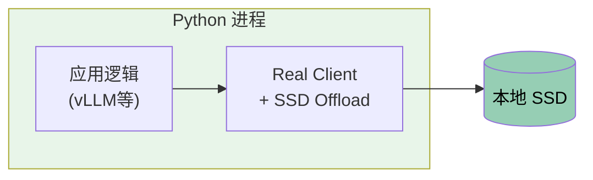
```mermaid
flowchart LR
    subgraph PY["Python 进程"]
        APP["应用逻辑<br/>(vLLM等)"]
        RC["Real Client<br/>+ SSD Offload"]
    end
    SSD[("本地 SSD")]

    APP --> RC --> SSD
    style PY fill:#e8f5e9
    style SSD fill:#96ceb4,color:#000
```

#### Mode B：独立 Real Client + DummyClient

独立的 `mooncake_client` 进程运行 SSD Offload，Python 进程通过 DummyClient 连接：

```bash
# 启动独立 Real Client
export MOONCAKE_OFFLOAD_FILE_STORAGE_PATH=/nvme/mooncake_offload
export MOONCAKE_OFFLOAD_STORAGE_BACKEND_DESCRIPTOR=bucket_storage_backend

mooncake_client \
    --master_server_address=127.0.0.1:50051 \
    --host=<机器IP> \
    --protocol="rdma" \
    --device_names=eth0 \
    --port=50052 \
    --global_segment_size="4GB" \
    --enable_offload=true
```

```python
# 应用通过 DummyClient 连接
store = MooncakeDistributedStore()
store.setup_dummy(
    mem_pool_size=4 * 1024 * 1024 * 1024,
    local_buffer_size=512 * 1024 * 1024,
    server_address="<机器IP>:50052"
)
```

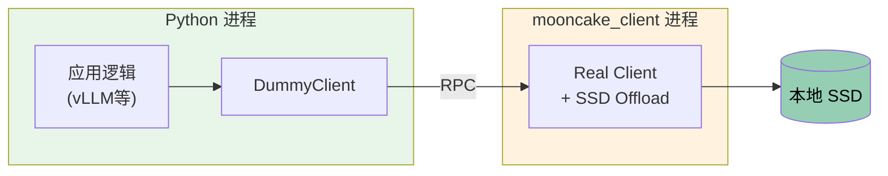
```mermaid
flowchart LR
    subgraph PY["Python 进程"]
        APP["应用逻辑<br/>(vLLM等)"]
        DC["DummyClient"]
    end
    subgraph MC["mooncake_client 进程"]
        RC["Real Client<br/>+ SSD Offload"]
    end
    SSD[("本地 SSD")]

    APP --> DC -->|"RPC"| RC --> SSD
    style PY fill:#e8f5e9
    style MC fill:#fff3e0
    style SSD fill:#96ceb4,color:#000
```

### 2.3 数据流：Offload（内存 → SSD）

Offload 路径完全由 FileStorage 内部的心跳线程驱动，应用层无需参与：

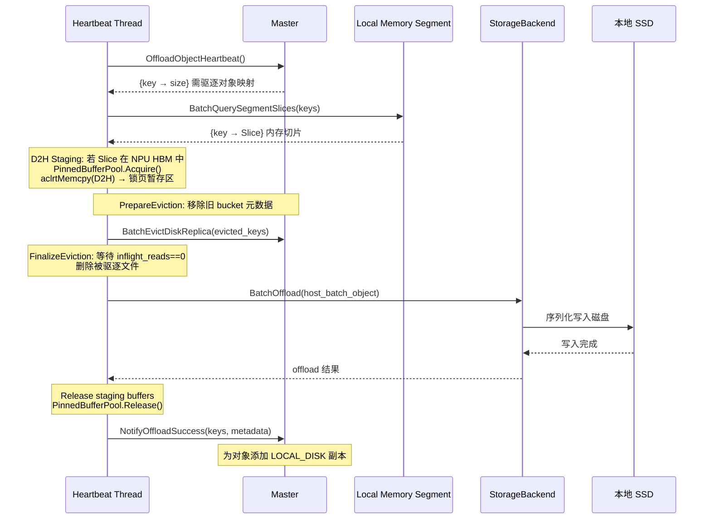
```mermaid
sequenceDiagram
    participant HB as Heartbeat Thread
    participant Master as Master
    participant Mem as Local Memory Segment
    participant BE as StorageBackend
    participant SSD as 本地 SSD

    HB->>Master: OffloadObjectHeartbeat()
    Master-->>HB: {key → size} 需驱逐对象映射

    HB->>Mem: BatchQuerySegmentSlices(keys)
    Mem-->>HB: {key → Slice} 内存切片

    Note over HB: D2H Staging: 若 Slice 在 NPU HBM 中<br/>PinnedBufferPool.Acquire()<br/>aclrtMemcpy(D2H) → 锁页暂存区

    Note over HB,Master: PrepareEviction: 移除旧 bucket 元数据
    HB->>Master: BatchEvictDiskReplica(evicted_keys)
    Note over HB: FinalizeEviction: 等待 inflight_reads==0<br/>删除被驱逐文件

    HB->>BE: BatchOffload(host_batch_object)
    BE->>SSD: 序列化写入磁盘
    SSD-->>BE: 写入完成
    BE-->>HB: offload 结果

    Note over HB: Release staging buffers<br/>PinnedBufferPool.Release()

    HB->>Master: NotifyOffloadSuccess(keys, metadata)
    Note over Master: 为对象添加 LOCAL_DISK 副本
```

**详细步骤：**

1. **心跳检测**：心跳线程每隔 `MOONCAKE_OFFLOAD_HEARTBEAT_INTERVAL_SECONDS`（默认10秒）调用 `client_->OffloadObjectHeartbeat()`，Master 返回需要驱逐的 `{key → size}` 映射
2. **读取内存切片**：`FileStorage::OffloadObjects` 将 key 按桶分组，调用 `BatchQuerySegmentSlices` 从本地内存段获取 `{key → Slice}`
3. **D2H 暂存**：如果数据在 NPU HBM 或 GPU VRAM 中，先通过 PinnedBufferPool 进行 Device-to-Host 拷贝（NPU 使用 `aclrtMemcpy`，GPU 使用 `cudaMemcpy`）
4. **驱逐旧数据**（如有容量限制）：`PrepareEviction` 在排他锁下移除旧桶的元数据，通过回调通知 Master；`FinalizeEviction` 等待进行中的读取完成后删除文件
5. **写入 SSD**：`StorageBackend::BatchOffload` 序列化并写入磁盘
6. **释放暂存区**：将 PinnedBufferPool 中的暂存缓冲区释放回池中
7. **通知 Master**：成功后回调 `client_->NotifyOffloadSuccess()`，Master 为对象添加 `LOCAL_DISK` 副本条目

### 2.4 数据流：Load（SSD → 内存）

Load 路径涉及三方协作：**请求方 Client**、**持有 SSD 数据的目标 Client**、**Transfer Engine**：

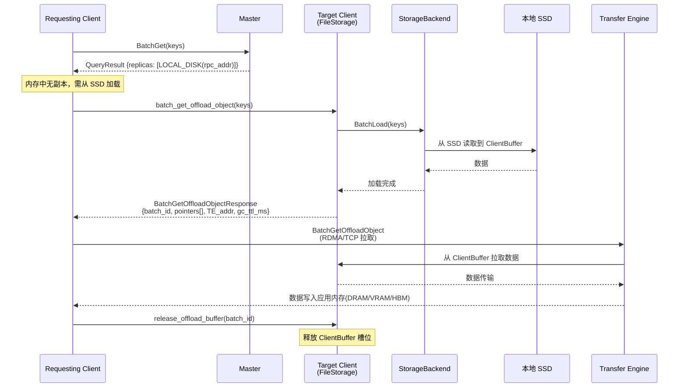
```mermaid
sequenceDiagram
    participant REQ as Requesting Client
    participant Master as Master
    participant TGT as Target Client<br/>(FileStorage)
    participant BE as StorageBackend
    participant SSD as 本地 SSD
    participant TE as Transfer Engine

    REQ->>Master: BatchGet(keys)
    Master-->>REQ: QueryResult {replicas: [LOCAL_DISK(rpc_addr)]}

    Note over REQ: 内存中无副本，需从 SSD 加载

    REQ->>TGT: batch_get_offload_object(keys)

    TGT->>BE: BatchLoad(keys)
    BE->>SSD: 从 SSD 读取到 ClientBuffer
    SSD-->>BE: 数据
    BE-->>TGT: 加载完成

    TGT-->>REQ: BatchGetOffloadObjectResponse<br/>{batch_id, pointers[], TE_addr, gc_ttl_ms}

    REQ->>TE: BatchGetOffloadObject<br/>(RDMA/TCP 拉取)
    TE->>TGT: 从 ClientBuffer 拉取数据
    TGT-->>TE: 数据传输
    TE-->>REQ: 数据写入应用内存(DRAM/VRAM/HBM)

    REQ->>TGT: release_offload_buffer(batch_id)
    Note over TGT: 释放 ClientBuffer 槽位
```

**关键设计亮点：**

- **零拷贝传输**：请求方 Client 通过 Transfer Engine（RDMA/TCP）直接从目标 Client 的 ClientBuffer 拉取数据到应用目标内存（DRAM、VRAM 或 NPU HBM），无中间拷贝
- **Buffer 租约机制**：目标 Client 返回的 buffer 带有 `gc_ttl_ms` 租约，超时后 GC 线程自动回收，防止资源泄漏
- **L2→L1 提升（Promotion）**：心跳周期内还会处理 Master 下发的 Promotion 任务，将热点 SSD 数据提升回内存

### 2.5 三种存储后端

Mooncake 提供了三种 StorageBackend 实现，通过 `MOONCAKE_OFFLOAD_STORAGE_BACKEND_DESCRIPTOR` 环境变量选择：

#### (1) BucketStorageBackend（默认推荐）

将多个对象分组到**桶（Bucket）**中再写入磁盘，每个桶产生两个文件：

```
/nvme/mooncake_offload/
├── 1710000000000-0.bucket   # 数据文件（包含多个KV对的序列化数据）
├── 1710000000000-0.meta     # 元数据文件（描述key和字节偏移）
├── 1710000000001-0.bucket
├── 1710000000001-0.meta
└── ...
```

**分组策略**：对象累积到桶中，直到达到 `bucket_size_limit`（默认256MB）或 `bucket_keys_limit`（默认500个key）。未填满桶的对象保留在 `ungrouped_offloading_objects_` 中，下次心跳重试。

**在途读追踪**：`BucketReadGuard` RAII 对象在构造时递增 `inflight_reads_`，析构时递减，确保并发读取期间安全删除桶文件。

**驱逐策略**：

| 策略 | 候选选择方式 |
|------|------------|
| `none` | 不驱逐（默认），磁盘满时写入失败 |
| `fifo` | 选择最旧的桶（`buckets_.begin()`） |
| `lru` | 选择最久未被读取的桶（`last_access_ns_` 最小） |

**两阶段驱逐协议**：

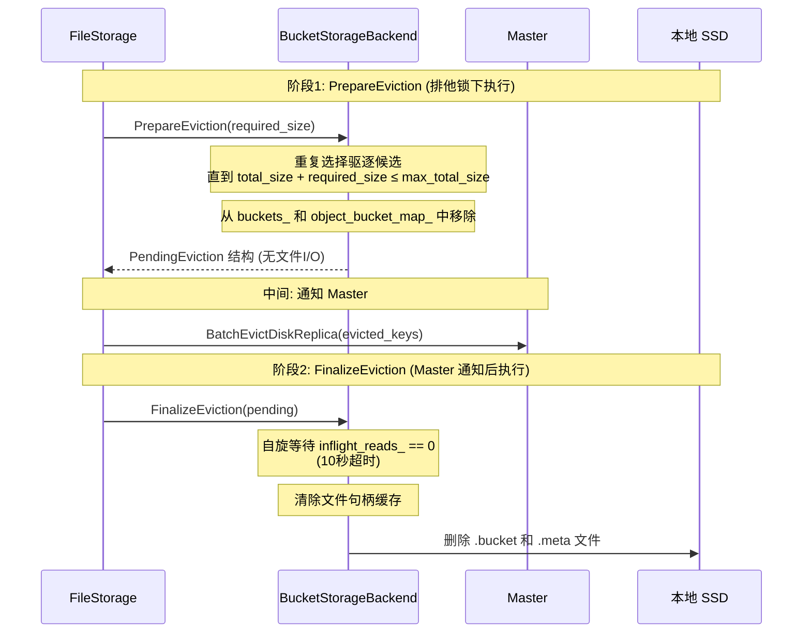
```mermaid
sequenceDiagram
    participant FS as FileStorage
    participant BE as BucketStorageBackend
    participant Master as Master
    participant SSD as 本地 SSD

    Note over FS,SSD: 阶段1: PrepareEviction (排他锁下执行)
    FS->>BE: PrepareEviction(required_size)
    Note over BE: 重复选择驱逐候选<br/>直到 total_size + required_size ≤ max_total_size
    Note over BE: 从 buckets_ 和 object_bucket_map_ 中移除
    BE-->>FS: PendingEviction 结构 (无文件I/O)

    Note over FS,Master: 中间: 通知 Master
    FS->>Master: BatchEvictDiskReplica(evicted_keys)

    Note over FS,SSD: 阶段2: FinalizeEviction (Master 通知后执行)
    FS->>BE: FinalizeEviction(pending)
    Note over BE: 自旋等待 inflight_reads_ == 0<br/>(10秒超时)
    Note over BE: 清除文件句柄缓存
    BE->>SSD: 删除 .bucket 和 .meta 文件
```

这种两阶段设计保证了：
- Master 永远不会提供已删除文件的过时磁盘副本位置
- 正在进行的读取不会被打断
- 释放的磁盘空间在 WriteBucket 之前就已可用

#### (2) FilePerKeyStorageBackend

每个对象存储为独立文件，通过两级哈希分片目录结构避免大平面目录：

```
/nvme/mooncake_offload/
└── file_per_key_dir/
    ├── ab/
    │   └── <hash1>_<key1>
    └── cd/
        └── <hash2>_<key2>
```

简单易调试，但百万级对象时文件系统开销大。

#### (3) OffsetAllocatorStorageBackend

预分配单个大文件 `kv_cache.data`，通过 OffsetAllocator 管理偏移量分配。元数据分片到 1024 个独立 map 以降低锁竞争：

```
记录布局: [key_len: u32 | value_len: u32 | key | value]
```

⚠️ **不支持重启恢复**：初始化时截断数据文件并清空内存元数据。

**三种后端对比：**

| 特性 | Bucket | FilePerKey | OffsetAllocator |
|------|--------|------------|-----------------|
| 文件组织 | 多对象合并 | 一对象一文件 | 单文件偏移分配 |
| 文件系统开销 | 低 | 高 | 最低 |
| 并发性能 | 中 | 低 | 最高（1024分片） |
| 驱逐支持 | FIFO/LRU | 简单驱逐 | 无 |
| 重启恢复 | ✅ ScanMeta | ✅ ScanMeta | ❌ 截断数据 |
| 适用场景 | 通用、大规模 | 调试、小规模 | 高并发、无需持久化 |

### 2.6 io_uring 高性能 I/O

当 `MOONCAKE_OFFLOAD_USE_URING=true` 时，存储后端用 io_uring 替代 POSIX `pread`/`pwrite`：

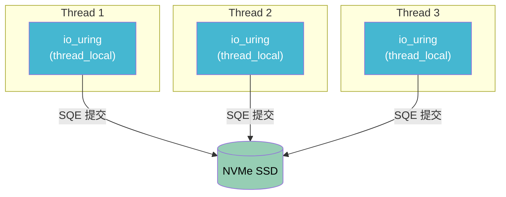
```mermaid
flowchart TB
    subgraph T1["Thread 1"]
        UR1["io_uring<br/>(thread_local)"]
    end
    subgraph T2["Thread 2"]
        UR2["io_uring<br/>(thread_local)"]
    end
    subgraph T3["Thread 3"]
        UR3["io_uring<br/>(thread_local)"]
    end

    SSD[("NVMe SSD")]

    UR1 -->|"SQE 提交"| SSD
    UR2 -->|"SQE 提交"| SSD
    UR3 -->|"SQE 提交"| SSD

    style UR1 fill:#45b7d1,color:#fff
    style UR2 fill:#45b7d1,color:#fff
    style UR3 fill:#45b7d1,color:#fff
    style SSD fill:#96ceb4,color:#000
```

- **无线程间互斥**：每个线程独占一个 io_uring 实例（thread_local），并发 I/O 完全并行
- **批量化提交**：`batch_read` 一次提交最多 32 个 SQE，充分利用 NVMe 队列深度
- **固定缓冲区注册**：ClientBuffer 通过 `io_uring_register_buffers` 注册为固定缓冲区，避免每次 I/O 的内核 mmap/munmap 开销
- **THP 兼容**：注册前对缓冲区应用 `MADV_NOHUGEPAGE`，强制 4KB 页面支持，确保 `FOLL_LONGTERM` 页面钉选可靠
- **O_DIRECT 支持**：对齐约束下直接 I/O，非对齐写入使用临时对齐弹跳缓冲区

### 2.7 元数据恢复

启动时 `FileStorage::Init` 调用 `StorageBackend::ScanMeta`，读取磁盘元数据并通过回调重新向 Master 注册对象：

- **Bucket / FilePerKey 后端**：扫描现有元数据文件，恢复完整视图
- **OffsetAllocator 后端**：截断数据文件，不恢复

---

## 三、SSD 在 NPU（昇腾 Ascend）上的实现

> 本节重点阐述 Mooncake SSD 存储在华为昇腾 NPU 上的完整实现机制，包括数据暂存、传输引擎、内存管理和异构通信等关键功能。

### 3.1 NPU SSD 整体架构

在昇腾 NPU 环境中，KV Cache 数据存储在 NPU 的 HBM（High Bandwidth Memory）中，而 SSD 只能通过主机侧访问。因此，NPU 与 SSD 之间的数据交换必须经过 **D2H（Device-to-Host）和 H2D（Host-to-Device）** 的暂存中转。Mooncake 通过 `gpu_staging_utils`、`PinnedBufferPool` 和 `AscendDirectTransport` 三层协作，实现了高效的 NPU-SSD 数据通路。

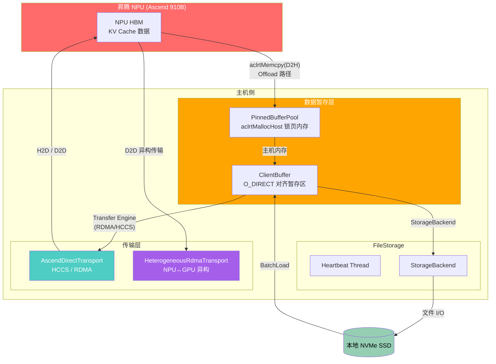
```mermaid
flowchart TB
    subgraph NPU["昇腾 NPU (Ascend 910B)"]
        HBM["NPU HBM<br/>KV Cache 数据"]
    end

    subgraph HOST["主机侧"]
        subgraph STAGING["数据暂存层"]
            PBP["PinnedBufferPool<br/>aclrtMallocHost 锁页内存"]
            CB["ClientBuffer<br/>O_DIRECT 对齐暂存区"]
        end
        subgraph FS["FileStorage"]
            HB["Heartbeat Thread"]
            BE["StorageBackend"]
        end
        subgraph TE_LAYER["传输层"]
            ADT["AscendDirectTransport<br/>HCCS / RDMA"]
            HET["HeterogeneousRdmaTransport<br/>NPU↔GPU 异构"]
        end
    end

    SSD[("本地 NVMe SSD")]

    HBM -->|"aclrtMemcpy(D2H)<br/>Offload 路径"| PBP
    PBP -->|"主机内存"| CB
    CB -->|"StorageBackend"| BE
    BE -->|"文件 I/O"| SSD

    SSD -->|"BatchLoad"| CB
    CB -->|"Transfer Engine<br/>(RDMA/HCCS)"| ADT
    ADT -->|"H2D / D2D"| HBM

    HBM -->|"D2D 异构传输"| HET

    style NPU fill:#ff6b6b,color:#fff
    style STAGING fill:#ffa502,color:#fff
    style SSD fill:#96ceb4,color:#000
    style ADT fill:#4ecdc4,color:#fff
    style HET fill:#a55eea,color:#fff
```

### 3.2 NPU 设备指针检测与数据暂存

Mooncake 通过 `gpu_staging_utils.h` 实现了统一的异构设备指针检测接口，能够自动识别数据是否位于 NPU HBM 中：

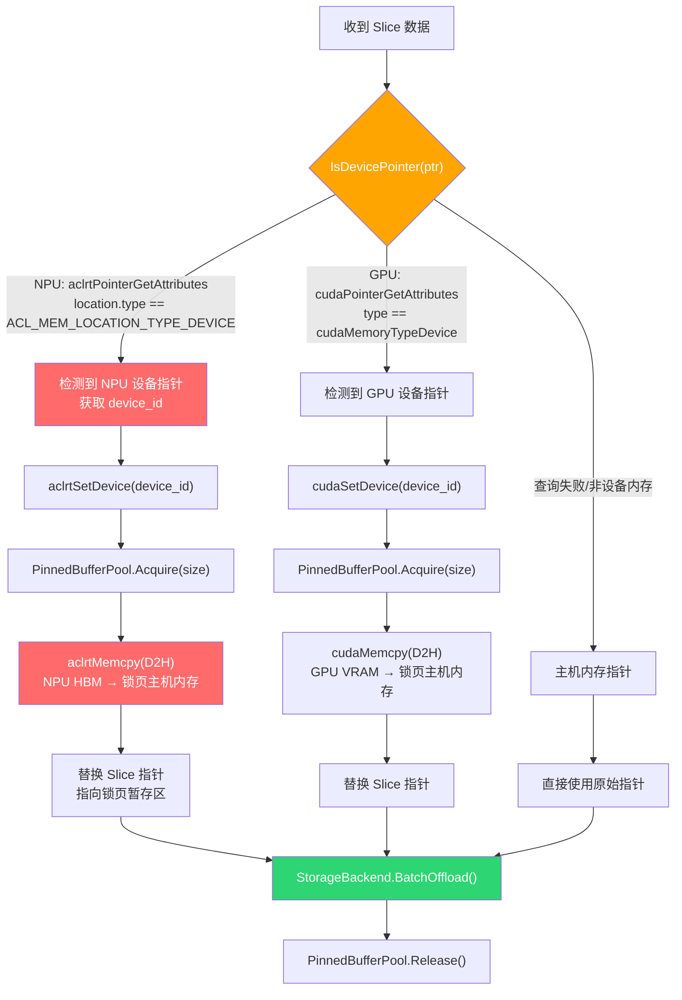
```mermaid
flowchart TD
    START["收到 Slice 数据"] --> CHECK{"IsDevicePointer(ptr)"}
    CHECK -->|"NPU: aclrtPointerGetAttributes<br/>location.type == ACL_MEM_LOCATION_TYPE_DEVICE"| NPU_DEV["检测到 NPU 设备指针<br/>获取 device_id"]
    CHECK -->|"GPU: cudaPointerGetAttributes<br/>type == cudaMemoryTypeDevice"| GPU_DEV["检测到 GPU 设备指针"]
    CHECK -->|"查询失败/非设备内存"| HOST_MEM["主机内存指针"]

    NPU_DEV --> SET_DEV["aclrtSetDevice(device_id)"]
    SET_DEV --> ACQUIRE["PinnedBufferPool.Acquire(size)"]
    ACQUIRE --> D2H["aclrtMemcpy(D2H)<br/>NPU HBM → 锁页主机内存"]
    D2H --> REPLACE["替换 Slice 指针<br/>指向锁页暂存区"]

    GPU_DEV --> SET_DEV2["cudaSetDevice(device_id)"]
    SET_DEV2 --> ACQUIRE2["PinnedBufferPool.Acquire(size)"]
    ACQUIRE2 --> D2H2["cudaMemcpy(D2H)<br/>GPU VRAM → 锁页主机内存"]
    D2H2 --> REPLACE2["替换 Slice 指针"]

    HOST_MEM --> DIRECT["直接使用原始指针"]

    REPLACE --> OFFLOAD["StorageBackend.BatchOffload()"]
    REPLACE2 --> OFFLOAD
    DIRECT --> OFFLOAD
    OFFLOAD --> RELEASE["PinnedBufferPool.Release()"]

    style CHECK fill:#ffa502,color:#fff
    style NPU_DEV fill:#ff6b6b,color:#fff
    style D2H fill:#ff6b6b,color:#fff
    style OFFLOAD fill:#2ed573,color:#fff
```

**关键代码路径**（[file_storage.cpp](file:///Users/fangjianwei/fjw/ground/Mooncake/mooncake-store/src/file_storage.cpp#L489-L550)）：

```cpp
// D2H staging: replace device slices with host memory slices
std::unordered_map<std::string, std::vector<Slice>> host_batch_object;
std::vector<PinnedBufferPool::Buffer> staging_bufs;

for (auto& [obj_key, slices] : batch_object) {
    std::vector<Slice> host_slices;
    for (const auto& slice : slices) {
        int device_id = -1;
        if (IsDevicePointer(slice.ptr, &device_id)) {
            SetDevice(device_id);                    // aclrtSetDevice
            auto buf = pinned_buffer_pool_->Acquire(slice.size);
            CopyDeviceToHost(buf.data, slice.ptr, slice.size); // aclrtMemcpy(D2H)
            host_slices.emplace_back(Slice{buf.data, slice.size});
            staging_bufs.push_back(buf);
        } else {
            host_slices.push_back(slice);
        }
    }
    host_batch_object[obj_key] = std::move(host_slices);
}
// ... BatchOffload ...
for (auto& buf : staging_bufs) {
    pinned_buffer_pool_->Release(buf);
}
```

### 3.3 PinnedBufferPool：NPU 锁页内存池

PinnedBufferPool 是 NPU SSD 数据通路的关键组件。它使用 `aclrtMallocHost` 分配锁页（pinned）主机内存，相比普通可分页内存提供 **10x~100x 的 D2H 带宽提升**。

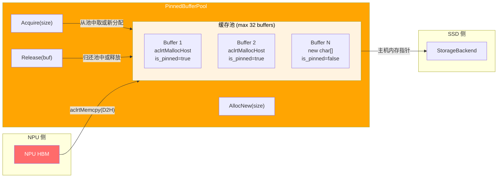
```mermaid
flowchart LR
    subgraph PBP["PinnedBufferPool"]
        direction TB
        ALLOC["AllocNew(size)"]
        ACQ["Acquire(size)"]
        REL["Release(buf)"]

        subgraph POOL["缓存池 (max 32 buffers)"]
            B1["Buffer 1<br/>aclrtMallocHost<br/>is_pinned=true"]
            B2["Buffer 2<br/>aclrtMallocHost<br/>is_pinned=true"]
            BN["Buffer N<br/>new char[]<br/>is_pinned=false"]
        end
    end

    subgraph NPU_SIDE["NPU 侧"]
        HBM["NPU HBM"]
    end

    subgraph SSD_SIDE["SSD 侧"]
        BE["StorageBackend"]
    end

    ACQ -->|"从池中取或新分配"| POOL
    REL -->|"归还池中或释放"| POOL
    HBM -->|"aclrtMemcpy(D2H)"| POOL
    POOL -->|"主机内存指针"| BE

    style PBP fill:#ffa502,color:#fff
    style POOL fill:#fff3e0,color:#000
    style HBM fill:#ff6b6b,color:#fff
```

**NPU 平台的关键 API 映射**：

| 功能 | CUDA | Ascend NPU | 说明 |
|------|------|-----------|------|
| 锁页内存分配 | `cudaMallocHost` | `aclrtMallocHost` | 分配页锁定主机内存 |
| 锁页内存释放 | `cudaFreeHost` | `aclrtFreeHost` | 释放锁页内存 |
| D2H 拷贝 | `cudaMemcpy(D2H)` | `aclrtMemcpy(DEVICE_TO_HOST)` | 设备到主机拷贝 |
| H2D 拷贝 | `cudaMemcpy(H2D)` | `aclrtMemcpy(HOST_TO_DEVICE)` | 主机到设备拷贝 |
| 自动方向拷贝 | `cudaMemcpy(Default)` | `aclrtMemcpy` + 属性判断 | 自动判断传输方向 |
| 设备绑定 | `cudaSetDevice` | `aclrtSetDevice` | 绑定线程到设备上下文 |
| 指针属性查询 | `cudaPointerGetAttributes` | `aclrtPointerGetAttributes` | 检测指针所在位置 |

**降级策略**：当 `aclrtMallocHost` 分配失败时，PinnedBufferPool 自动降级为 `new char[]` 可分页内存，确保功能可用但性能下降。

### 3.4 AscendDirectTransport：NPU 间高速传输

AscendDirectTransport 是基于 CANN ADXL 能力构建的传输适配层，直接兼容 Mooncake Transfer Engine，支持 NPU 环境下的 Host-to-Device、Device-to-Host、Device-to-Device 传输。

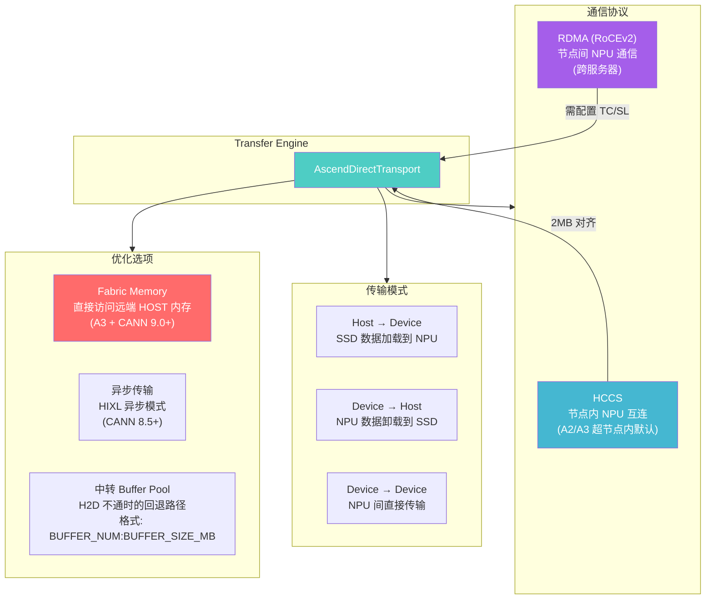
```mermaid
flowchart TB
    subgraph TE["Transfer Engine"]
        ADT["AscendDirectTransport"]
    end

    subgraph PROTOCOLS["通信协议"]
        HCCS["HCCS<br/>节点内 NPU 互连<br/>(A2/A3 超节点内默认)"]
        RDMA["RDMA (RoCEv2)<br/>节点间 NPU 通信<br/>(跨服务器)"]
    end

    subgraph MODES["传输模式"]
        H2D["Host → Device<br/>SSD 数据加载到 NPU"]
        D2H["Device → Host<br/>NPU 数据卸载到 SSD"]
        D2D["Device → Device<br/>NPU 间直接传输"]
    end

    subgraph OPT["优化选项"]
        FABRIC["Fabric Memory<br/>直接访问远端 HOST 内存<br/>(A3 + CANN 9.0+)"]
        ASYNC["异步传输<br/>HIXL 异步模式<br/>(CANN 8.5+)"]
        BUFPOOL["中转 Buffer Pool<br/>H2D 不通时的回退路径<br/>格式: BUFFER_NUM:BUFFER_SIZE_MB"]
    end

    ADT --> PROTOCOLS
    ADT --> MODES
    ADT --> OPT

    HCCS -->|"2MB 对齐"| ADT
    RDMA -->|"需配置 TC/SL"| ADT

    style ADT fill:#4ecdc4,color:#fff
    style HCCS fill:#45b7d1,color:#fff
    style RDMA fill:#a55eea,color:#fff
    style FABRIC fill:#ff6b6b,color:#fff
```

**关键环境变量配置**：

| 变量 | 说明 | 默认值 |
|------|------|--------|
| `ASCEND_AUTO_CONNECT` | 自动连接管理（需 CANN 9.0+） | 0 |
| `ASCEND_ENABLE_USE_FABRIC_MEM` | 启用 Fabric Memory 模式（A3 专用） | 0 |
| `ASCEND_USE_ASYNC_TRANSFER` | 启用异步传输（需 CANN 8.5+） | 0 |
| `ASCEND_BUFFER_POOL` | 中转缓冲区配置 `NUM:SIZE_MB` | 0:0 |
| `ASCEND_TRANSFER_TIMEOUT` | 数据传输超时(ms) | 3000 |
| `ASCEND_CONNECT_TIMEOUT` | 建链超时(ms) | 3000 |
| `ASCEND_THREAD_POOL_SIZE` | 传输线程池大小 | 8 |
| `HCCL_INTRA_ROCE_ENABLE` | 节点内使用 RDMA 替代 HCCS | 0 |

### 3.5 NPU SSD Offload 完整数据流

以下时序图展示了 NPU 环境下 SSD Offload 的完整数据流，包括 D2H 暂存、SSD 写入和后续加载的完整过程：

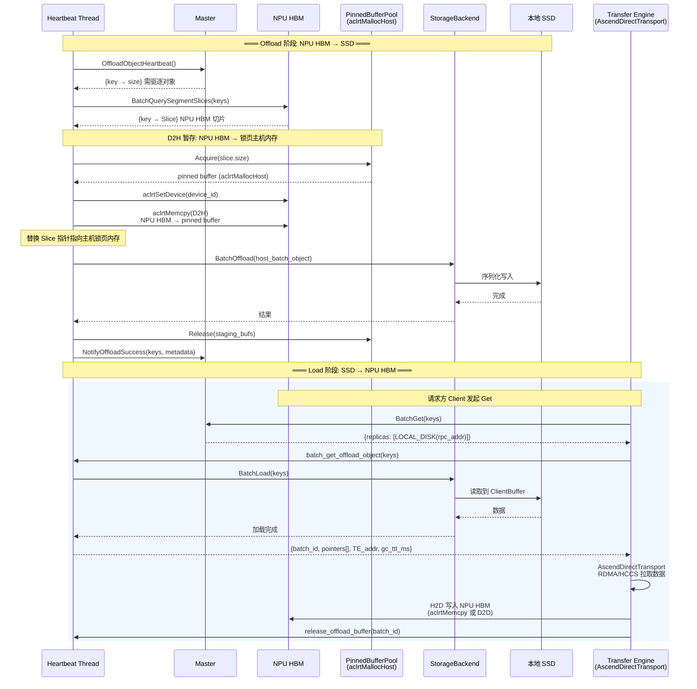
```mermaid
sequenceDiagram
    participant HB as Heartbeat Thread
    participant Master as Master
    participant NPU as NPU HBM
    participant PBP as PinnedBufferPool<br/>(aclrtMallocHost)
    participant BE as StorageBackend
    participant SSD as 本地 SSD
    participant TE as Transfer Engine<br/>(AscendDirectTransport)

    Note over HB,SSD: ═══ Offload 阶段: NPU HBM → SSD ═══

    HB->>Master: OffloadObjectHeartbeat()
    Master-->>HB: {key → size} 需驱逐对象

    HB->>NPU: BatchQuerySegmentSlices(keys)
    NPU-->>HB: {key → Slice} NPU HBM 切片

    Note over HB,PBP: D2H 暂存: NPU HBM → 锁页主机内存
    HB->>PBP: Acquire(slice.size)
    PBP-->>HB: pinned buffer (aclrtMallocHost)
    HB->>NPU: aclrtSetDevice(device_id)
    HB->>NPU: aclrtMemcpy(D2H)<br/>NPU HBM → pinned buffer

    Note over HB: 替换 Slice 指针指向主机锁页内存

    HB->>BE: BatchOffload(host_batch_object)
    BE->>SSD: 序列化写入
    SSD-->>BE: 完成
    BE-->>HB: 结果

    HB->>PBP: Release(staging_bufs)
    HB->>Master: NotifyOffloadSuccess(keys, metadata)

    Note over HB,TE: ═══ Load 阶段: SSD → NPU HBM ═══

    rect rgb(240, 248, 255)
        Note over TE,NPU: 请求方 Client 发起 Get
        TE->>Master: BatchGet(keys)
        Master-->>TE: {replicas: [LOCAL_DISK(rpc_addr)]}
        TE->>HB: batch_get_offload_object(keys)

        HB->>BE: BatchLoad(keys)
        BE->>SSD: 读取到 ClientBuffer
        SSD-->>BE: 数据
        BE-->>HB: 加载完成

        HB-->>TE: {batch_id, pointers[], TE_addr, gc_ttl_ms}
        TE->>TE: AscendDirectTransport<br/>RDMA/HCCS 拉取数据
        TE->>NPU: H2D 写入 NPU HBM<br/>(aclrtMemcpy 或 D2D)
        TE->>HB: release_offload_buffer(batch_id)
    end
```

### 3.6 Heterogeneous Ascend Transport：NPU-GPU 异构传输

在异构推理场景中，910B NPU 执行 PREFILL 操作，H20 GPU 执行 DECODE 操作，需要跨设备传输 KVCache。HeterogeneousRdmaTransport 通过**数据聚合 + 流水线并行**优化了小数据块的传输效率：

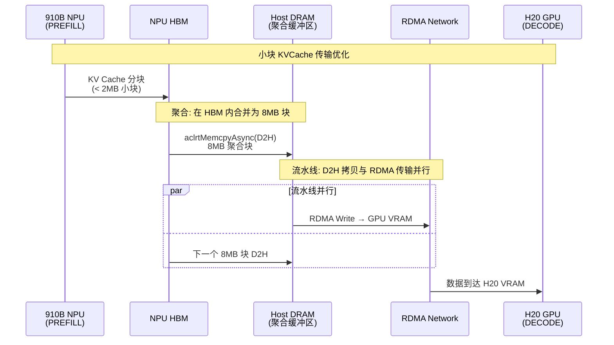
```mermaid
sequenceDiagram
    participant NPU as 910B NPU<br/>(PREFILL)
    participant HBM as NPU HBM
    participant HOST as Host DRAM<br/>(聚合缓冲区)
    participant RDMA as RDMA Network
    participant GPU as H20 GPU<br/>(DECODE)

    Note over NPU,GPU: 小块 KVCache 传输优化

    NPU->>HBM: KV Cache 分块<br/>(< 2MB 小块)
    Note over HBM,HOST: 聚合: 在 HBM 内合并为 8MB 块
    HBM->>HOST: aclrtMemcpyAsync(D2H)<br/>8MB 聚合块

    Note over HOST,RDMA: 流水线: D2H 拷贝与 RDMA 传输并行
    par 流水线并行
        HOST->>RDMA: RDMA Write → GPU VRAM
    and
        HBM->>HOST: 下一个 8MB 块 D2H
    end

    RDMA->>GPU: 数据到达 H20 VRAM
```

**关键优化**：
- **数据聚合**：在 HBM 内将 <2MB 的小数据块合并为 8MB 大块，充分利用 HBM→DRAM 带宽
- **流水线并行**：D2H 拷贝与 RDMA 传输重叠执行，掩盖 D2H 延迟
- **异步拷贝**：使用 `aclrtMemcpyAsync` + `aclrtSynchronizeStream` 实现异步 D2H

### 3.7 NPU 内存管理：VMM 与 IPC

Mooncake 在 NPU 环境中支持两种高级内存管理模式，用于跨进程共享 NPU 内存：

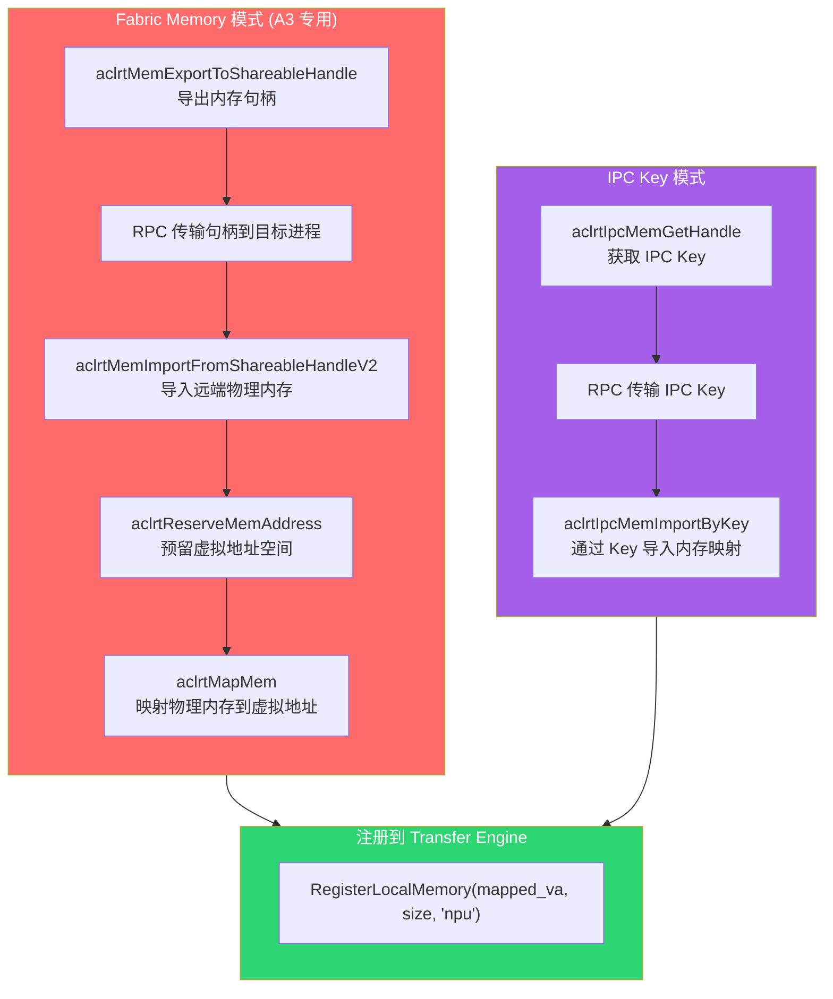
```mermaid
flowchart TB
    subgraph MODE_A["Fabric Memory 模式 (A3 专用)"]
        direction TB
        FM1["aclrtMemExportToShareableHandle<br/>导出内存句柄"]
        FM2["RPC 传输句柄到目标进程"]
        FM3["aclrtMemImportFromShareableHandleV2<br/>导入远端物理内存"]
        FM4["aclrtReserveMemAddress<br/>预留虚拟地址空间"]
        FM5["aclrtMapMem<br/>映射物理内存到虚拟地址"]
        FM1 --> FM2 --> FM3 --> FM4 --> FM5
    end

    subgraph MODE_B["IPC Key 模式"]
        direction TB
        IK1["aclrtIpcMemGetHandle<br/>获取 IPC Key"]
        IK2["RPC 传输 IPC Key"]
        IK3["aclrtIpcMemImportByKey<br/>通过 Key 导入内存映射"]
        IK1 --> IK2 --> IK3
    end

    subgraph REG["注册到 Transfer Engine"]
        R1["RegisterLocalMemory(mapped_va, size, 'npu')"]
    end

    MODE_A --> REG
    MODE_B --> REG

    style MODE_A fill:#ff6b6b,color:#fff
    style MODE_B fill:#a55eea,color:#fff
    style REG fill:#2ed573,color:#fff
```

**Fabric Memory 模式**（推荐，A3 + CANN 9.0+）：
- 通过 `ASCEND_ENABLE_USE_FABRIC_MEM=1` 启用
- 允许直接访问远端 HOST 内存，显著提升传输性能
- 使用 VMM（Virtual Memory Management）API 管理物理内存的导入导出

**IPC Key 模式**：
- 使用 `aclrtIpcMemGetHandle` / `aclrtIpcMemImportByKey` 实现跨进程内存共享
- 适用于非 A3 平台

### 3.8 NPU SSD 实现的编译与部署

**编译选项**：在 `mooncake-common/common.cmake` 中设置：

| 编译宏 | 说明 |
|--------|------|
| `USE_ASCEND_DIRECT=ON` | 启用 AscendDirectTransport（推荐） |
| `USE_ASCEND=ON` | 启用旧版 Ascend Transport（已弃用） |
| `USE_ASCEND_HETEROGENEOUS=ON` | 启用 NPU-GPU 异构传输 |

**NPU SSD Offload 部署示例**：

```bash
# 启动 NPU 环境的 Real Client
export MOONCAKE_OFFLOAD_FILE_STORAGE_PATH=/nvme/mooncake_offload
export MOONCAKE_OFFLOAD_STORAGE_BACKEND_DESCRIPTOR=bucket_storage_backend
export ASCEND_ENABLE_USE_FABRIC_MEM=1  # A3 平台推荐开启
export ASCEND_BUFFER_POOL=4:8          # 中转缓冲区配置

mooncake_client \
    --master_server_address=127.0.0.1:50051 \
    --host=<机器IP> \
    --protocol="ascend" \
    --port=50052 \
    --global_segment_size="4GB" \
    --enable_offload=true
```

**注意事项**：
1. 调用 `TransferEngine.initialize()` 前必须设置设备：`torch.npu.set_device(0)`
2. HCCS 协议要求注册内存地址 2MB 对齐
3. 容器环境需确保 `/etc/hccn.conf` 存在
4. RDMA 超时配置：`ASCEND_TRANSFER_TIMEOUT` 应略大于 `4.096us × 2^HCCL_RDMA_TIMEOUT × HCCL_RDMA_RETRY_CNT`

---

## 四、方式二：NVMe-oF SSD 资源池

### 4.1 整体架构

NVMe-oF（NVMe over Fabrics）SSD 资源池是 Mooncake 提供的另一种 SSD 实现方式，其核心思想是：**通过 SPDK 将远程 SSD 节点组成资源池，Client 通过 RDMA 网络直接访问远程 SSD，实现 SSD 资源的池化和共享。**

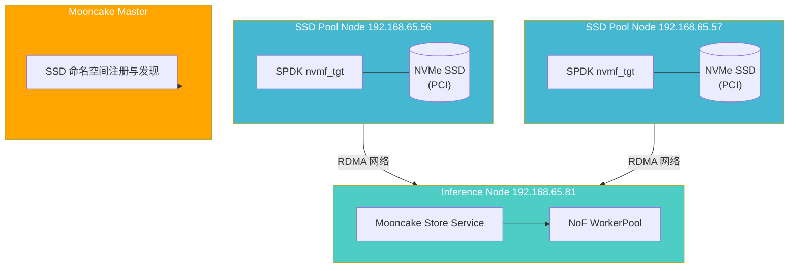
```mermaid
flowchart TB
    subgraph MASTER["Mooncake Master"]
        MGR["SSD 命名空间注册与发现"]
    end

    subgraph POOL1["SSD Pool Node 192.168.65.56"]
        SPDK1["SPDK nvmf_tgt"]
        NVME1[("NVMe SSD<br/>(PCI)")]
        SPDK1 --- NVME1
    end

    subgraph POOL2["SSD Pool Node 192.168.65.57"]
        SPDK2["SPDK nvmf_tgt"]
        NVME2[("NVMe SSD<br/>(PCI)")]
        SPDK2 --- NVME2
    end

    subgraph INF["Inference Node 192.168.65.81"]
        STORE["Mooncake Store Service"]
        NOF["NoF WorkerPool"]
    end

    MASTER --> MGR
    POOL1 -->|"RDMA 网络"| INF
    POOL2 -->|"RDMA 网络"| INF
    STORE --> NOF

    style MASTER fill:#ffa502,color:#fff
    style POOL1 fill:#45b7d1,color:#fff
    style POOL2 fill:#45b7d1,color:#fff
    style INF fill:#4ecdc4,color:#fff
```

### 4.2 核心组件

#### SPDK NVMe-oF Target

在 SSD Pool 节点上运行 SPDK `nvmf_tgt` 进程，将本地 NVMe SSD 暴露为 NVMe-oF 目标：

```bash
# 部署 SSD Pool
python3 -m mooncake.spdk_tgt_create \
    --spdk_target_info="ip:192.168.65.56 path:/home/spdk pci:0000:01:00.0,0000:02:00.0" \
    --spdk_target_info="ip:192.168.65.57 path:/home/spdk" \
    --transport-type=RDMA \
    --max-queue-depth=128 \
    --max-io-qpairs-per-ctrlr=127
```

#### SpdkNofWorkerPool

Client 端的 SPDK NVMe-oF 工作线程池，负责异步执行 NVMe-oF I/O 操作：

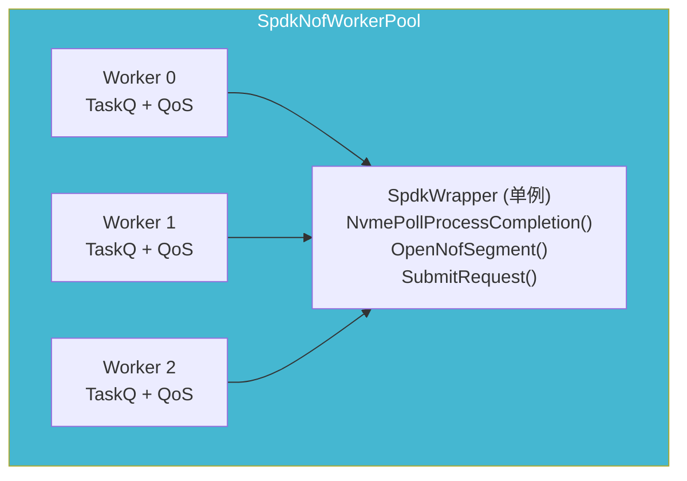
```mermaid
flowchart TB
    subgraph POOL["SpdkNofWorkerPool"]
        W0["Worker 0<br/>TaskQ + QoS"]
        W1["Worker 1<br/>TaskQ + QoS"]
        W2["Worker 2<br/>TaskQ + QoS"]
        SW["SpdkWrapper (单例)<br/>NvmePollProcessCompletion()<br/>OpenNofSegment()<br/>SubmitRequest()"]
    end

    W0 --> SW
    W1 --> SW
    W2 --> SW

    style POOL fill:#45b7d1,color:#fff
```

**QoS 控制**：通过三个环境变量提供细粒度的 I/O 流控：

| 参数 | 默认值 | 说明 |
|------|--------|------|
| `MC_NOF_WORKERS` | 4 | 工作线程数 |
| `MC_NOF_SUBMIT_CHUNK_BYTES` | 128KB | 每次 I/O 提交的大小 |
| `MC_NOF_INFLIGHT_BYTES_LIMIT` | 32MB | 系统中允许的在途 I/O 字节数上限 |

#### SSD 注册与发现

SSD 资源通过 Master 进行注册和发现：

```bash
# 注册 SSD 到 Master
python3 -m mooncake.mooncake_ssd_register \
    --master_server_address=192.168.65.81:50051 \
    --spdk_target_info="ip:192.168.65.56 path:/home/spdk" \
    --spdk_target_info="ip:192.168.65.57 path:/home/spdk"
```

### 4.3 数据流

#### 写入路径（DRAM → NVMe-oF SSD）

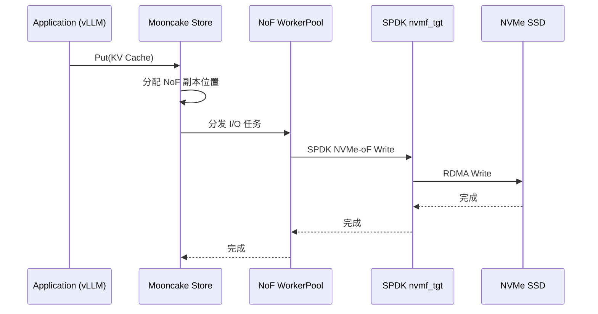
```mermaid
sequenceDiagram
    participant APP as Application (vLLM)
    participant STORE as Mooncake Store
    participant NOF as NoF WorkerPool
    participant SPDK as SPDK nvmf_tgt
    participant SSD as NVMe SSD

    APP->>STORE: Put(KV Cache)
    STORE->>STORE: 分配 NoF 副本位置
    STORE->>NOF: 分发 I/O 任务
    NOF->>SPDK: SPDK NVMe-oF Write
    SPDK->>SSD: RDMA Write
    SSD-->>SPDK: 完成
    SPDK-->>NOF: 完成
    NOF-->>STORE: 完成
```

#### 读取路径（NVMe-oF SSD → DRAM）

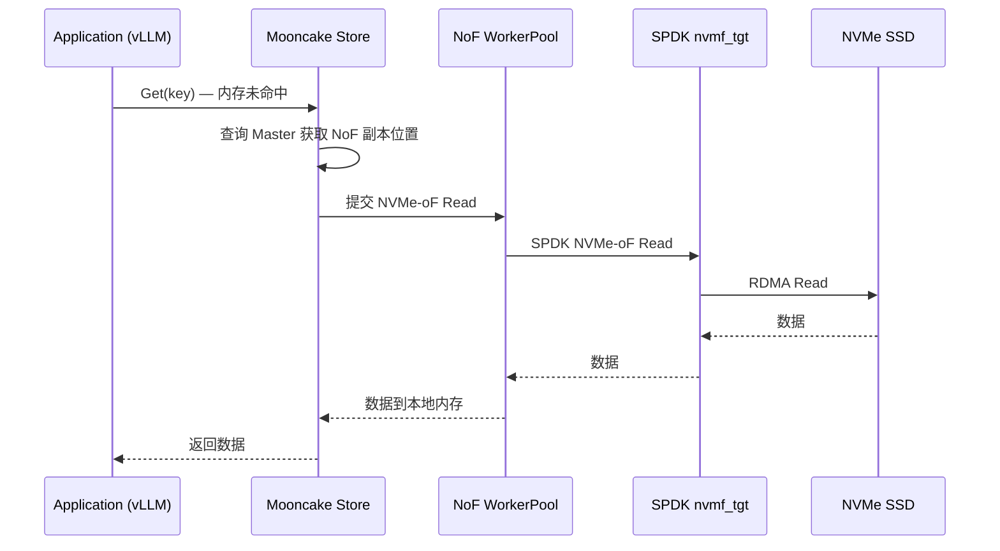
```mermaid
sequenceDiagram
    participant APP as Application (vLLM)
    participant STORE as Mooncake Store
    participant NOF as NoF WorkerPool
    participant SPDK as SPDK nvmf_tgt
    participant SSD as NVMe SSD

    APP->>STORE: Get(key) — 内存未命中
    STORE->>STORE: 查询 Master 获取 NoF 副本位置
    STORE->>NOF: 提交 NVMe-oF Read
    NOF->>SPDK: SPDK NVMe-oF Read
    SPDK->>SSD: RDMA Read
    SSD-->>SPDK: 数据
    SPDK-->>NOF: 数据
    NOF-->>STORE: 数据到本地内存
    STORE-->>APP: 返回数据
```

### 4.4 与 LMCache 集成

NVMe-oF SSD 资源池可以与 vLLM + LMCache 集成使用：

```yaml
# LMCache 配置
chunk_size: 256
remote_url: "mooncakestore://192.168.65.81:50051/"
enable_mooncake_nof_pool: True    # 启用 NoF 池写入

extra_config:
  local_hostname: "localhost"
  metadata_server: "http://192.168.65.81:8080/metadata"
  master_server_address: "192.168.65.81:50051"
  global_segment_size: 0           # 不贡献内存段
  local_buffer_size: 1073741824    # 仍需本地暂存缓冲区
  protocol: "rdma"
  device_name: "mlx5_0"
```

---

## 五、两种方式的深度对比

### 5.1 架构对比

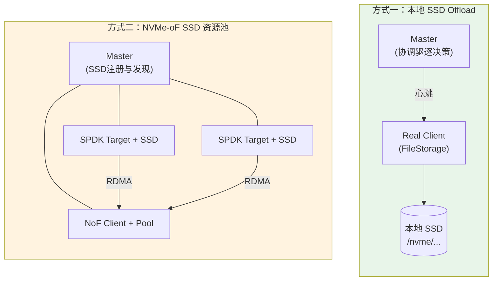
```mermaid
flowchart TB
    subgraph LOCAL["方式一：本地 SSD Offload"]
        direction TB
        M1["Master<br/>(协调驱逐决策)"]
        RC1["Real Client<br/>(FileStorage)"]
        SSD1[("本地 SSD<br/>/nvme/...")]
        M1 -->|"心跳"| RC1
        RC1 --> SSD1
    end

    subgraph NOF["方式二：NVMe-oF SSD 资源池"]
        direction TB
        M2["Master<br/>(SSD注册与发现)"]
        SPDK_A["SPDK Target + SSD"]
        SPDK_B["SPDK Target + SSD"]
        NOFC["NoF Client + Pool"]
        M2 --- SPDK_A
        M2 --- SPDK_B
        M2 --- NOFC
        SPDK_A -->|"RDMA"| NOFC
        SPDK_B -->|"RDMA"| NOFC
    end

    style LOCAL fill:#e8f5e9
    style NOF fill:#fff3e0
```

### 5.2 关键差异

| 维度 | 本地 SSD Offload | NVMe-oF SSD 资源池 |
|------|-----------------|-------------------|
| **数据位置** | 本地 NVMe SSD | 远程 SSD 集群 |
| **访问方式** | 本地文件 I/O | RDMA 网络访问 |
| **I/O 引擎** | POSIX / io_uring | SPDK 用户态驱动 |
| **驱逐决策** | Master 协调 + 本地执行 | 无需驱逐（池化容量） |
| **存储后端** | Bucket / FilePerKey / OffsetAllocator | SPDK NVMe-oF 命名空间 |
| **零拷贝** | ClientBuffer + Transfer Engine | SPDK + RDMA 直接传输 |
| **部署依赖** | 仅需本地 SSD | 需 SPDK + RDMA 网络 |
| **容量扩展** | 受单机 SSD 限制 | 可横向扩展 SSD 节点 |
| **重启恢复** | Bucket/FilePerKey 支持 | N/A（池化管理） |
| **NPU 支持** | ✅ PinnedBufferPool + AscendDirectTransport | ✅ SPDK + RDMA |
| **典型集成** | SGLang HiCache | vLLM + LMCache |

### 5.3 选型建议

```mermaid
flowchart TD
    START["你的场景是什么？"] --> Q1{"集群规模？"}
    Q1 -->|"单节点/少量节点"| A["本地 SSD Offload<br/>(Mode A)"]
    Q1 -->|"多节点共享 SSD"| B["本地 SSD Offload<br/>(Mode B)"]
    Q1 -->|"大规模 SSD 池化"| C["NVMe-oF SSD 资源池"]

    A --> Q2{"使用 NPU？"}
    B --> Q2
    Q2 -->|"是"| NPU_OPT["启用 AscendDirectTransport<br/>+ PinnedBufferPool<br/>+ Fabric Memory (A3)"]
    Q2 -->|"否"| GPU_OPT["标准 GPU/CPU 部署"]

    style START fill:#ffa502,color:#fff
    style NPU_OPT fill:#ff6b6b,color:#fff
    style GPU_OPT fill:#4ecdc4,color:#fff
```

---

## 六、性能实测

### 6.1 本地 SSD Offload 基准测试

在 DGX 服务器（8×A100-40GB，双 RDMA NIC，5×NVMe RAID0）上，使用 Qwen3-8B 模型的多轮对话测试：

| 配置 | 平均 TTFT | 输入 Token 吞吐 |
|------|----------|----------------|
| GPU Only | 基准 | 1.0× |
| L1 + L2 (HiCache) | 降低 | 1.5× |
| L1 + L2 + Mooncake | 降低 35% | 1.8× |
| L1 + L2 + Mooncake + SSD | **降低 57%** | **2.4×** |

```mermaid
xychart-beta
    title "多轮对话缓存命中率对比"
    x-axis ["R1", "R2", "R3", "R4", "R5", "R6", "R7", "R8"]
    y-axis "命中率 (%)" 0 --> 100
    bar [83, 85, 84, 83, 82, 83, 36, 35]
    bar [83, 85, 84, 83, 82, 83, 84, 85]
```

当第7轮对话的 KV Cache 累积超过内存容量时：
- **无 SSD**：命中率从 83% 骤降至 36%，TTFT 从 6s 飙升到 16s
- **有 SSD**：被驱逐的条目在磁盘上存活，命中率保持在 84% 以上，TTFT 仅 9.4s

---

## 七、代码关键路径索引

| 功能 | 关键文件 |
|------|---------|
| FileStorage 协调器 | [file_storage.h](file:///Users/fangjianwei/fjw/ground/Mooncake/mooncake-store/include/file_storage.h) / [file_storage.cpp](file:///Users/fangjianwei/fjw/ground/Mooncake/mooncake-store/src/file_storage.cpp) |
| NPU 设备指针检测与 D2H 暂存 | [gpu_staging_utils.h](file:///Users/fangjianwei/fjw/ground/Mooncake/mooncake-store/include/gpu_staging_utils.h) |
| NPU 锁页内存池 | [pinned_buffer_pool.h](file:///Users/fangjianwei/fjw/ground/Mooncake/mooncake-store/include/pinned_buffer_pool.h) |
| AscendDirectTransport | [ascend_direct_transport.h](file:///Users/fangjianwei/fjw/ground/Mooncake/mooncake-transfer-engine/include/transport/ascend_transport/ascend_direct_transport/ascend_direct_transport.h) |
| NPU 内存管理 (VMM/IPC) | [real_client.cpp](file:///Users/fangjianwei/fjw/ground/Mooncake/mooncake-store/src/real_client.cpp) |
| HeterogeneousRdmaTransport | [heterogeneous_rdma_transport.cpp](file:///Users/fangjianwei/fjw/ground/Mooncake/mooncake-transfer-engine/src/transport/ascend_transport/heterogeneous_rdma_transport/heterogeneous_rdma_transport.cpp) |
| StorageBackend 接口与实现 | [storage_backend.h](file:///Users/fangjianwei/fjw/ground/Mooncake/mooncake-store/include/storage_backend.h) / [storage_backend.cpp](file:///Users/fangjianwei/fjw/ground/Mooncake/mooncake-store/src/storage_backend.cpp) |
| SPDK NVMe-oF 封装 | [spdk_wrapper.h](file:///Users/fangjianwei/fjw/ground/Mooncake/mooncake-store/include/spdk/spdk_wrapper.h) / [spdk_wrapper.cpp](file:///Users/fangjianwei/fjw/ground/Mooncake/mooncake-store/src/spdk/spdk_wrapper.cpp) |
| NoF Worker Pool | [transfer_task.h](file:///Users/fangjianwei/fjw/ground/Mooncake/mooncake-store/include/transfer_task.h) / [transfer_task.cpp](file:///Users/fangjianwei/fjw/ground/Mooncake/mooncake-store/src/transfer_task.cpp) |
| Client DFS 持久化 | [client_service.cpp](file:///Users/fangjianwei/fjw/ground/Mooncake/mooncake-store/src/client_service.cpp) |

---

## 八、总结

Mooncake 的 SSD 存储实现体现了**分级缓存**的设计哲学：

1. **本地 SSD Offload** 以心跳驱动的被动卸载为核心，通过多种存储后端和 io_uring 优化，在不改变应用逻辑的前提下将缓存容量扩展到本地 SSD，是当前最成熟、最易部署的方案

2. **NVMe-oF SSD 资源池** 以 SPDK 用户态驱动和 RDMA 网络为基础，将 SSD 资源池化共享，适合大规模集群场景，但部署复杂度更高

3. **NPU SSD 实现** 通过三层协作实现高效数据通路：
   - **gpu_staging_utils**：自动检测 NPU 设备指针，统一 D2H/H2D 拷贝接口
   - **PinnedBufferPool**：使用 `aclrtMallocHost` 分配锁页内存，提供 10x~100x 的 D2H 带宽提升
   - **AscendDirectTransport**：基于 CANN ADXL 实现 H2D/D2H/D2D 高速传输，支持 HCCS/RDMA 多协议

两种方式共同构成了 Mooncake 从 DRAM 到 SSD 的完整存储层次，为 LLM 推理场景提供了灵活、高效的 KV Cache 容量扩展方案。在实际部署中，可以根据集群规模、SSD 资源分布和性能需求选择合适的实现方式，甚至可以组合使用——本地 SSD 作为 L3 缓存，NVMe-oF 资源池作为 L4 持久化存储，进一步延长 KV Cache 的生命周期。
