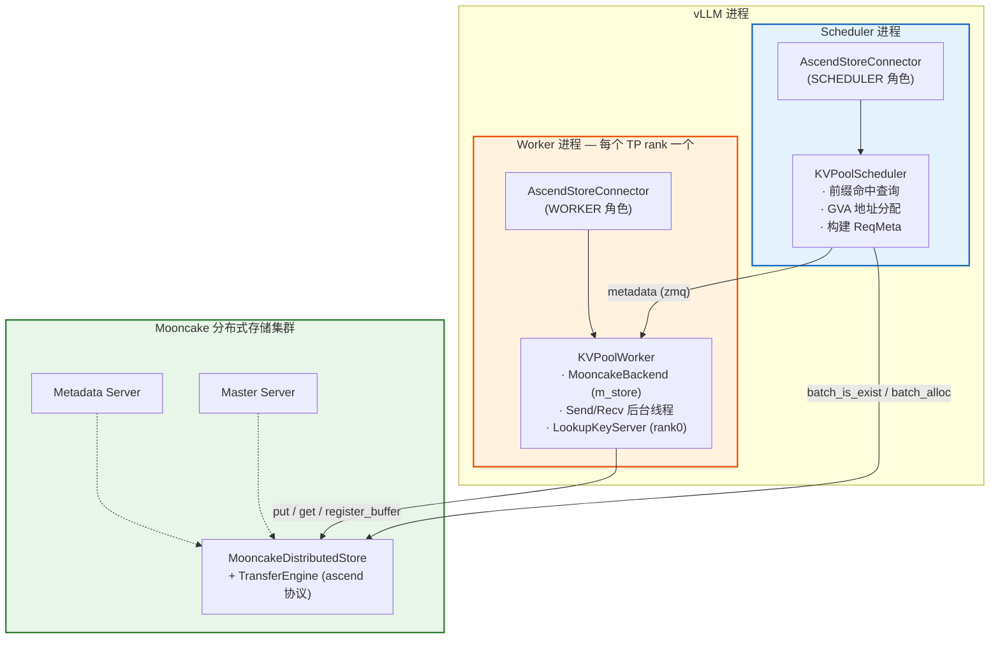
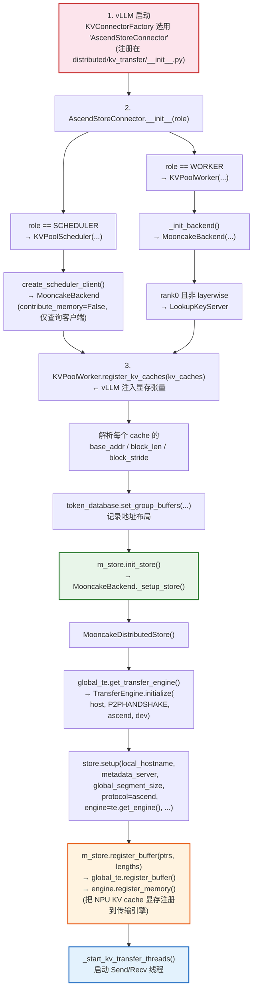
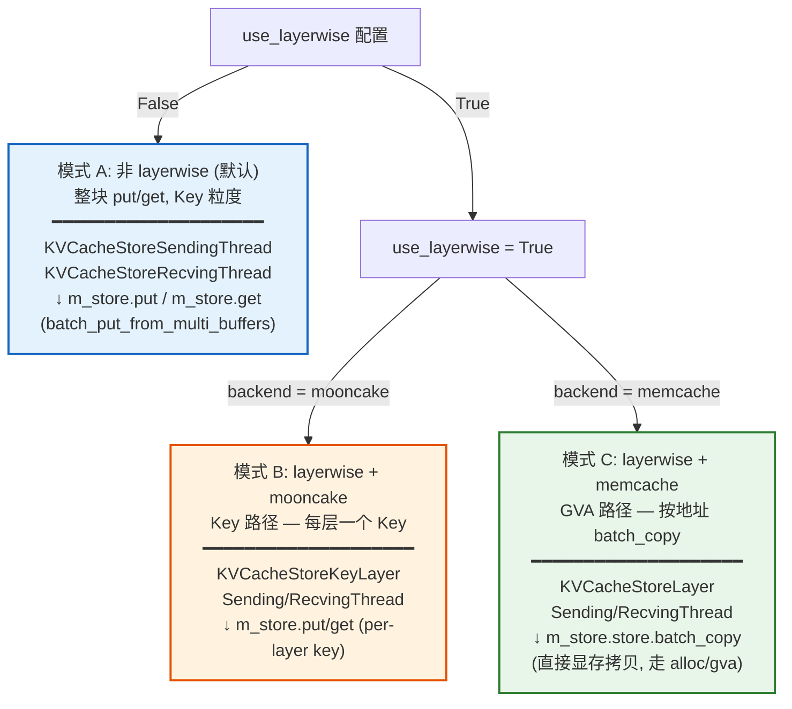
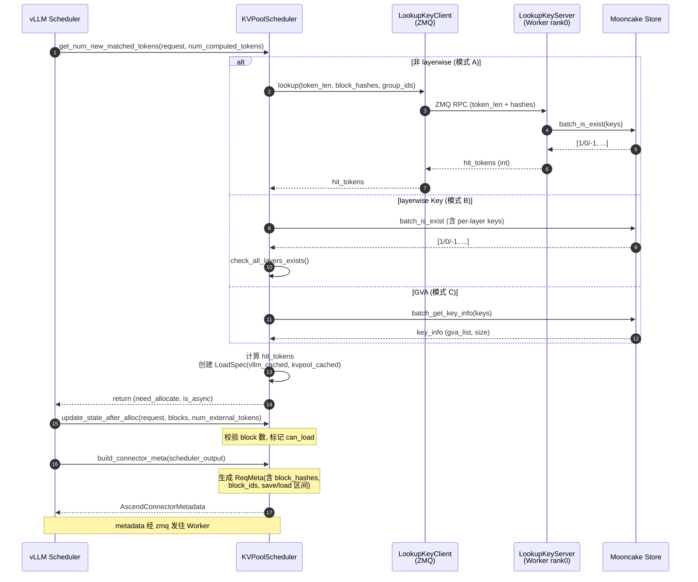
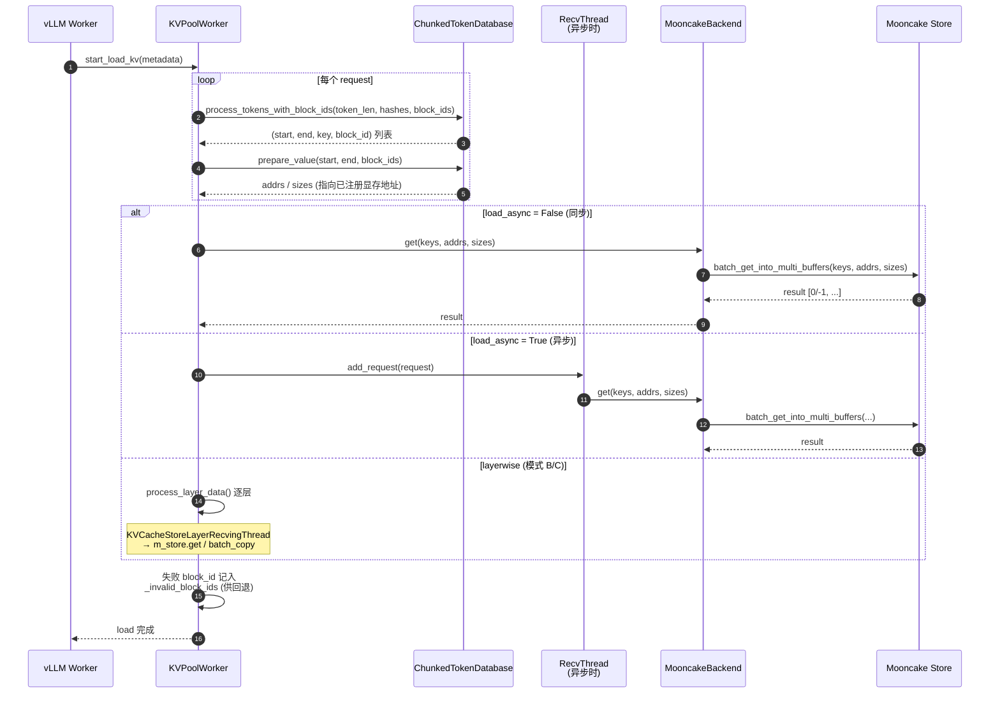
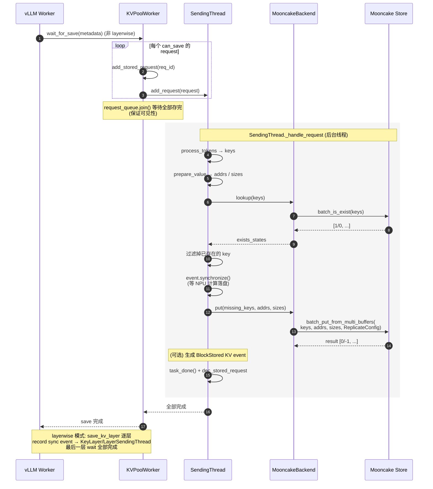
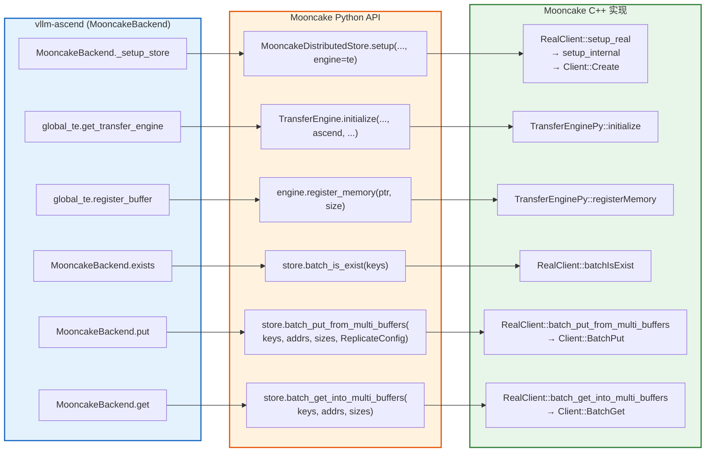
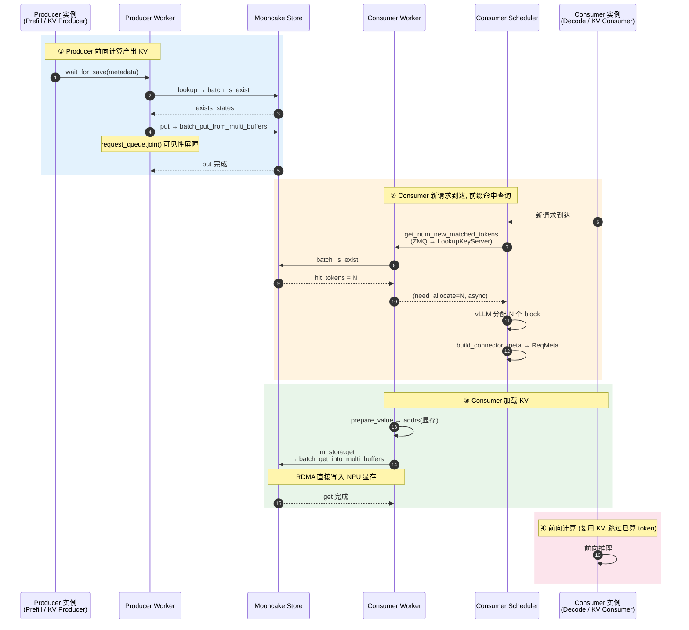

# vLLM-Ascend AscendStore KV Cache Pool 调用流程分析

> 本文结合 `vllm-ascend` 的 `ascend_store` 池化实现与 `Mooncake` 的 Store/TransferEngine 代码，分析 vLLM-Ascend 是如何调用 KV Cache Pool 的。
>
> 文档中所有图表使用 **Mermaid** 语法绘制，可在 GitHub、VS Code（Mermaid 插件）、Typora、GitLab 等支持 Mermaid 的 Markdown 阅读器中直接渲染为清晰矢量图。

---

## 1. 总体架构

vLLM-Ascend 通过 `AscendStoreConnector` 接入 vLLM v1 的 KV Connector 框架，实现跨实例的 KV Cache 共享（Prefill/Decode 分离、跨节点 Prefix Caching）。底层使用 **Mooncake** 作为分布式 KV Store 后端，借助其 `TransferEngine` 完成 NPU 显存的 RDMA/HCCL 直接传输。



### 核心组件一览

| 组件 | 文件 | 职责 |
|------|------|------|
| `AscendStoreConnector` | `ascend_store_connector.py` | 入口，实现 vLLM `KVConnectorBase_V1`，按角色分流到 Scheduler/Worker |
| `KVPoolScheduler` | `pool_scheduler.py` | Scheduler 侧：前缀命中查询、GVA 分配、构建 `ReqMeta` 元数据 |
| `KVPoolWorker` | `pool_worker.py` | Worker 侧：初始化后端、注册显存、启动收发线程、执行 load/save |
| `Backend` (ABC) | `backend/backend.py` | 后端抽象接口：`put/get/exists/register_buffer` |
| `MooncakeBackend` | `backend/mooncake_backend.py` | Mooncake 后端实现，封装 `MooncakeDistributedStore` |
| `KVTransferThread` 系列 | `kv_transfer.py` | 后台收发线程，异步执行 put/get/batch_copy |
| `ChunkedTokenDatabase` | `config_data.py` | KV Key 生成、地址/大小计算（`process_tokens`/`prepare_value`） |
| `global_te` | `utils/mooncake_transfer_engine.py` | TransferEngine 单例，`initialize`/`register_memory` |

---

## 2. 初始化流程



**关键点**：Mooncake 的 `store.setup()` 接收一个外部传入的 `TransferEngine`（`engine=` 参数）。该 engine 由 vLLM-Ascend 侧的 `GlobalTE` 单例创建，使用 `ascend` 协议初始化，使得 Mooncake 后续的 `put/get` 能直接对已注册的 NPU 显存做 RDMA 传输，无需 CPU 中转。

---

## 3. 三种工作模式

AscendStore 通过 `use_layerwise` 与 `backend` 两个配置组合出三条数据通路：



- **模式 A（默认）**：一次把整块 KV（所有层）作为一个 key 存取。Scheduler 侧通过 ZMQ RPC 到 Worker 的 `LookupKeyServer` 做命中查询。
- **模式 B（layerwise Key）**：每个 layer 单独一个 key，逐层存取，可与计算重叠。
- **模式 C（layerwise GVA）**：用全局虚拟地址（GVA）直接 `batch_copy`，Scheduler 侧通过 `batch_alloc`/`batch_get_key_info` 管理 GVA。

> 下文以 **模式 A（mooncake 后端 + 非 layerwise）** 为主线说明（最常用），并标注其他分支差异。

---

## 4. 关键流程一：前缀命中查询（Scheduler 侧）

发生在请求调度阶段，决定能从 Pool 复用多少 token 的 KV。



**Key 生成规则**（`PoolKey.to_string()`）：

```
{model_name}@pcp{pcp_rank}@dcp{dcp_rank}@head_or_tp_rank:{rank}
           @pp_rank:{pp}@group:{gid}@cache_role:kv@cache_family:{fam}@{chunk_hash}
```

即 Key 包含模型名 + 并行维度（TP/PCP/DCP/PP）+ KV group + chunk hash，确保不同 rank/层的数据互不冲突。

---

## 5. 关键流程二：KV Load（Worker 侧，Consumer 加载）

发生在前向计算之前，把 Pool 中命中的 KV 拉回 NPU 显存。



**地址计算核心**（`prepare_value`）：对每个 cache 子张量，`addr = base_addr + block_id * block_stride`，`size = block_len / block_size * (end-start)`。因为显存已通过 `register_buffer` 注册到 TransferEngine，Mooncake 的 `batch_get_into_multi_buffers` 可直接把远端数据 DMA 写入这些地址。

---

## 6. 关键流程三：KV Save（Worker 侧，Producer 存储）

发生在前向计算之后，把新算出的 KV 推入 Pool 供其他实例复用。



**关键细节**：
- `wait_for_save` 中调用 `request_queue.join()` 阻塞直到所有 put 完成，确保请求被标记 finished 前 KV 已对其他实例可见（避免紧随的相同 prompt lookup miss）。
- `lookup` 先查存在的 key，只 put 缺失的 block，避免重复写入。
- `event.synchronize()`（NPU Event）保证该层计算真正落盘后再传输。

---

## 7. Mooncake 侧被调用的 API 总览

vLLM-Ascend（`MooncakeBackend`）实际调用的 Mooncake Python 接口（定义于 `mooncake-integration/store/store_py.cpp` 与 `transfer_engine_py.cpp`）：



| 调用方 (vllm-ascend) | Mooncake API | C++ 实现 | 用途 |
|---|---|---|---|
| `MooncakeBackend._setup_store` | `MooncakeDistributedStore().setup(..., engine=te)` | `RealClient::setup_real` → `setup_internal` → `Client::Create` | 初始化 Store，绑定 TransferEngine |
| `global_te.get_transfer_engine` | `TransferEngine().initialize(host,"P2PHANDSHAKE","ascend",dev)` | `TransferEnginePy::initialize` | 创建 ascend 协议传输引擎 |
| `global_te.register_buffer` | `engine.register_memory(ptr, size)` | `TransferEnginePy::registerMemory` | 注册 NPU 显存段 |
| `MooncakeBackend.exists` | `store.batch_is_exist(keys)` | `RealClient::batchIsExist` | 前缀命中检查 |
| `MooncakeBackend.put` | `store.batch_put_from_multi_buffers(keys, addrs, sizes, ReplicateConfig)` | `RealClient::batch_put_from_multi_buffers` → `Client::BatchPut` | 批量写入 KV |
| `MooncakeBackend.get` | `store.batch_get_into_multi_buffers(keys, addrs, sizes)` | `RealClient::batch_get_into_multi_buffers` → `Client::BatchGet` | 批量读取 KV |

**数据通路**：`batch_put_from_multi_buffers` 把每个 key 对应的多个 `(buffer_ptr, size)` 组装成 `Slice`，调用 `Client::BatchPut`；Mooncake 内部根据 replica 选择 + TransferEngine 完成跨节点 RDMA 写入。`get` 则反向，把远端数据直接拷进已注册的 NPU 显存地址。整个过程释放 GIL（`py::gil_scoped_release`），可与 vLLM 计算异步重叠。

---

## 8. 端到端时序图（非 layerwise + mooncake）



---

## 9. 小结

1. **接入方式**：`AscendStoreConnector` 实现 vLLM v1 KVConnector 接口，在 `__init__` 中按 `KVConnectorRole` 分裂为 Scheduler 端（`KVPoolScheduler`，负责命中查询/元数据）和 Worker 端（`KVPoolWorker`，负责实际收发）。

2. **Mooncake 集成**：Worker 通过 `MooncakeBackend` 持有 `MooncakeDistributedStore`，并把自己创建的 `TransferEngine`（ascend 协议）传入 `store.setup(engine=...)`。NPU 显存经 `register_memory` 注册后，Mooncake 的 `batch_put_from_multi_buffers` / `batch_get_into_multi_buffers` 可直接对其做 RDMA 读写，无需 CPU 拷贝。

3. **异步与重叠**：实际 put/get 在独立的 `KVTransferThread` 中执行，通过 `torch.npu.Event` 与计算流同步，配合 `load_async` / `use_layerwise` 实现传输与计算重叠。

4. **Key 设计**：以 `(model, TP/PCP/DCP/PP rank, kv_group, chunk_hash)` 为 key，天然支持多维并行与混合 cache family；layerwise 模式再追加 `layer_id` 维度。

5. **三种模式**：非 layerwise（整块 Key 存取）/ layerwise-Key（逐层 Key）/ layerwise-GVA（memcache 后端，按地址 batch_copy），由 `use_layerwise` + `backend` 配置切换，分别走不同的 Thread 子类与 Mooncake 接口。
